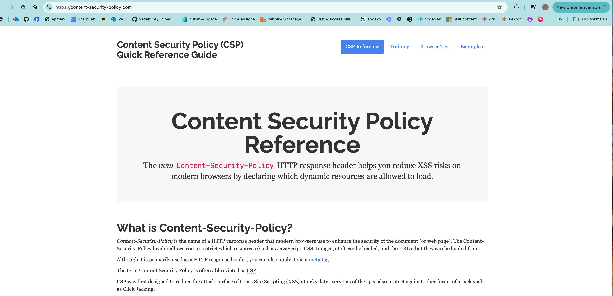
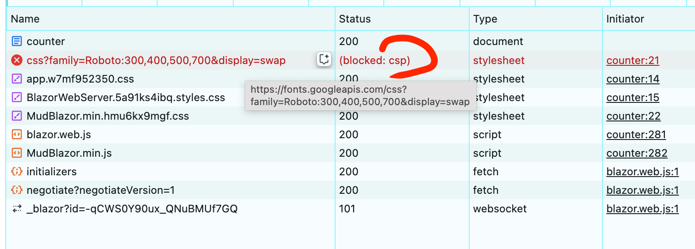
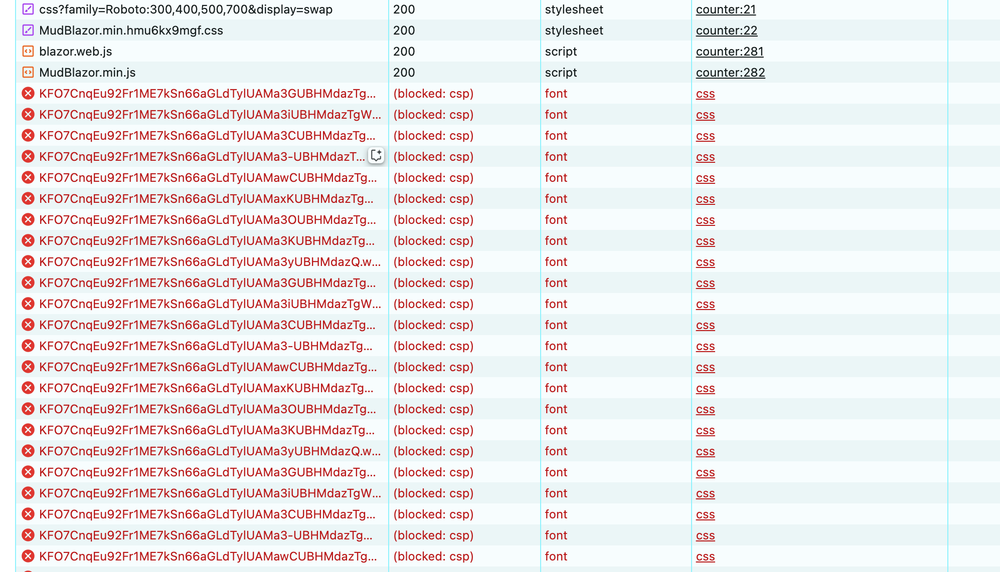

# AA Les attaques `XSS`


## `CSP` : `Content Security Policy` 

La référence des règles se trouve ici : https://content-security-policy.com/




## `CSP` et balise `meta`

`Blazor` ne gère pas lui-même la politique de sécurité du contenu (`Content Security Policy` : `CSP`).

On peut l'appliquer à l'ensemble du site via une balise `meta`.

```html
<meta 
      http-equiv="Content-Security-Policy" 
      content="default-src 'self'; script-src 'self' 'unsafe-inline'; style-src 'self' 'unsafe-inline'; img-src 'self' data:; font-src 'self'; connect-src 'self';">

```


### Explication des directives

`default-src 'self'` : Charge uniquement les ressources du domaine de l'application.

`script-src 'self' 'unsafe-inline'` : Autorise uniquement les scripts de votre domaine et les scripts inline (nécessaire si vous avez du JavaScript dans les pages).

`style-src 'self' 'unsafe-inline'` : Permet les styles du domaine et les styles inline. Il faut garder `'unsafe-inline'` si on a un `CDN` vers `Google font` ou des `css` injectés par `javascript` comme dans le cas de `MudBlazor`.

`img-src 'self' data:` : Autorise les images locales et les `data:` URI.

`font-src 'self'` : Autorise uniquement les polices locales.

`connect-src 'self'` : Restreint les connexions réseau à votre propre domaine (important pour SignalR).


### Exemple du blocage du `CDN` `Google Font`

Avec `style-src 'self'` l'appelle à `https://fonts.googleapis.com` est bloqué par les `CSP` :



De même si on authorise l'appelle distant de `css` mais pas celui précisemment des `fonts` :

```html

style-src 'self' 'unsafe-inline' https://fonts.googleapis.com; 
font-src 'self'; 
```




## `CSP` pour `MudBlazor`

> (ChatGPT)
>
> ### 1. **Faut-il gérer cela soi-même ?**
>
> Oui. Blazor Server repose sur **SignalR** pour la communication en temps réel entre le serveur et le client. Même si Blazor encode automatiquement les données injectées dans le DOM (ce qui empêche l'injection de scripts malveillants dans la plupart des cas), une politique de sécurité du contenu (**CSP**) bien configurée renforce encore la sécurité et prévient les attaques **XSS (Cross-Site Scripting)**.
>
> ### 2. **Est-ce grave de ne pas mettre de CSP ?**
>
> - En soi, Blazor encode déjà les sorties HTML, ce qui réduit les risques.
> - Cependant, si votre application Blazor Server charge des ressources externes (CDN, scripts JavaScript personnalisés, images, styles, etc.), elle peut être vulnérable aux attaques XSS ou aux injections de contenu malveillant.
> - Une CSP mal configurée peut aussi permettre l'inclusion de scripts non sécurisés.

```html
<meta http-equiv="Content-Security-Policy" content="
    default-src 'self'; 
    style-src 'self' 'unsafe-inline' https://fonts.googleapis.com; 
    font-src 'self' https://fonts.gstatic.com; 
    script-src 'self'; 
    connect-src 'self'; 
    img-src 'self' data:;
">
```

**`style-src 'self' 'unsafe-inline' https://fonts.googleapis.com`**

- 📌 Autorise **les styles locaux** (`self`).
- 📌 Autorise **les styles inline** (`'unsafe-inline'` → nécessaire pour MudBlazor).
- 📌 Autorise **Google Fonts CSS** (`https://fonts.googleapis.com`).

**`font-src 'self' https://fonts.gstatic.com`**

- 📌 Autorise **les polices locales** (`self`).
- 📌 Autorise **Google Fonts** (`https://fonts.gstatic.com`).