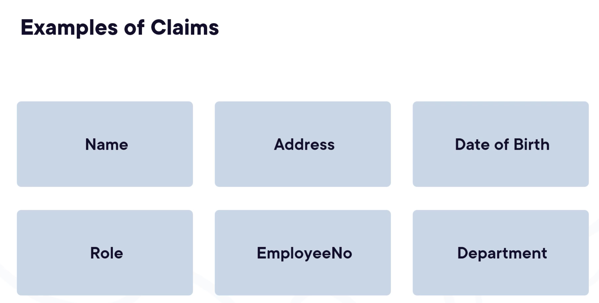
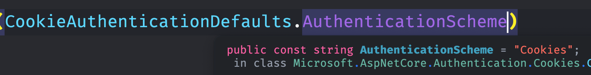
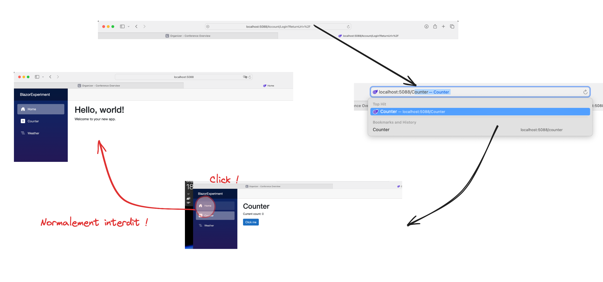

# 01 Authentification : les basique

## Authentification

Vérifier une identité est appelé `authentification`.

`asp.net` offre plusieurs outils :

- Identity cookies
- `asp.net` Core Identity
- Identity Provider (`OpenId Connect` et `OAuth`)


## Authorisation

Limiter les accès. (la clé d'un hôtel par exemple)

C'est ce qu'un utilisateur peut faire.

On a besoin de données d'autorisation, les `claims` obtenu lors de l'authentification peuvent servir à cela.




## `Cookie` scheme

Une `authentication scheme` est une manière d'authentifier.

Il peut y avoir plusieurs manière.


### Ajout du `Service`

`Cookie Scheme` est donc une `authentication` via les `cookies`.

On doit donner un nom à son `Authentication Scheme`.

```ruby
builder.Services.AddAuthentication()
    .AddCookie("IdentityCookie");
```

Par défaut le nom d'`authentication scheme` est `Cookie`. Ici je lui donne la valeur `IdentityCookie`.

On doit donner le `scheme` par défaut en paramètre à `AddAuthentication`.

Si on ne met rien il prendra le premier `scheme` configuré de sa liste.

```ruby
builder.Services.AddAuthentication(CookieAuthenticationDefaults.AuthenticationScheme)
    .AddCookie();
```




### Ajout du `Middleware`

Une bonne place est juste après `UseRouting` et avant `UseAntiforgery`.

```ruby
// ...
app.UseStaticFiles();

app.UseAuthentication();

app.UseAntiforgery();
// ...
```


## Restreindre un accès

On ajoute l'attribut `[Authorize]` en haut d'un composant (d'une page).

```ruby
@page "/"
@using Microsoft.AspNetCore.Authorization
@attribute [Authorize] 


<PageTitle>Home</PageTitle>
```

> Cependant il est facile de hacker cette sécurité en allant sur un composant non protégé et en revenant sur celui protégé, il est maintenant accessible !
>
> 
>
> Il faut modifier le `Router` avec `AuthorizeRouteView` :
>
> ```cs
> <Router AppAssembly="typeof(Program).Assembly">
>     <Found Context="routeData">
>         <AuthorizeRouteView RouteData="routeData" DefaultLayout="typeof(Layout.MainLayout)"/>
>         <FocusOnNavigate RouteData="routeData" Selector="h1"/>
>     </Found>
> </Router>
> ```
>
> 

À la première requête `HTTP`, on a une redirection vers l'`url` :

```http
http://localhost:5088/Account/Login?ReturnUrl=%2F
```

De par la nature particulière de `Blazor Server`, le check n'est pas réalisé par la navigation interne d'où le hack plus haut.

À la place on arrive sur une page avec un message `Not authorized`.


