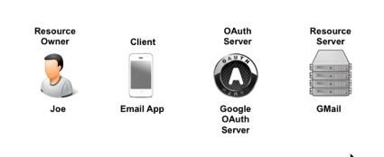
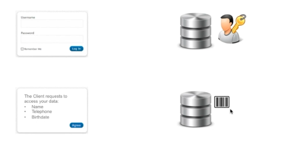

# 02. Les acteurs d'`OAuth`

### 

- `OAuth Provider` / `OAuth Server` / `Authorization Server`
- `Resource Provider` -> `Web API`
- `Resource Owner` -> le `User`
- `Client` -> `Cloud App` ou `Mobile App`

## `OAuth Provider`

Il est composé de trois parties.

- Une interface d'authentification : `Identity Server`
- Un pop-up de consentement : `Consent server`
- `Token Managment Infrastructure` c'est une `DB` qui conserve les `token` produits et envoyés, ainsi que les informations qui leurs sont associées.

Le `OAuth server` possède plusieurs `endpoint`:

- #### `/authorize GET` 
  
  C'est pour recevoir l'`authorization code` (`Authorization Code Grant`) ou l'`Access Token` (`Implicit Grant`). Ce `endpoint` est destiné au `Client`.
  
- #### `/token POST` 
  
  C'est un `endpoint` protégé uniquement accessible si on a le bon `ClientId` avec le bon `ClientSecret`. On obtient un `Access Token` et un `Refresh Token`. Utilisable pour `Authorization Code Grant`, `Client Credentials Grant` et `resource Owner Password Credentials Grant`.
  
- #### `/verify` 

  accessible uniquement au `Resource Server` et utilisé par lui pour savoir si un `Access Token` est valide.

## `Resource Provider`

Il doit s'assurer que seul les utilisateurs authentifiés et autorisés aient réellement accès aux données.

Il protège les données et propose souvent une `REST API`.

Il réclame un `OAuth Access Token` à chaque requête et vérifie sa validité.

Seul les requêtes possédant un `Access Token` valide ont accès aux ressources.

 

## `Resource Owner`

C'est le propriétaire de la `resource` protégée.

Il possède (connait) les `credentials` lui donnant accès à la `resource`.

Le `Resource Owner` délègue ses droits d'accès à l'application `Third Party`.

Le `Client`à travers cette délégation reçoit l'autorisation d'accéder aux données en tant que `Third Party`.

## `Client`

C'est une application souhaitant accéder à une `ressource` protégée.

Cela peut-être une `Web App`, une `Cloud App` ou bien une `Mobile App`.

Le `Client` possède les `Access Token` et `Refresh Token`.

Il ne possède pas les `Credentials`.

Il est identifié par son `ClientId` et son `ClientSecret`, cette `identité` est fournie par le `OAuth Server` via un enregistrement que le `Client` doit effectuer avant de pouvoir utiliser `OAuth`.

Un système informatique peut avoir plusieurs rôles (comme `Twitter` qui peut être `Resource Sever` ou `OAuth Provider`).

