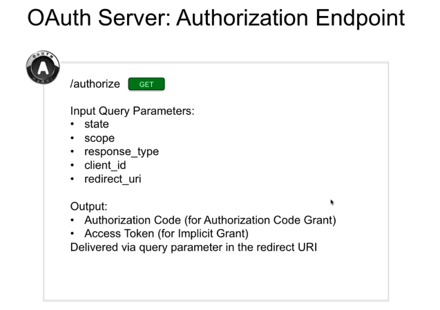
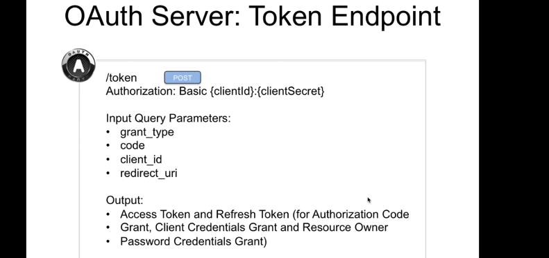
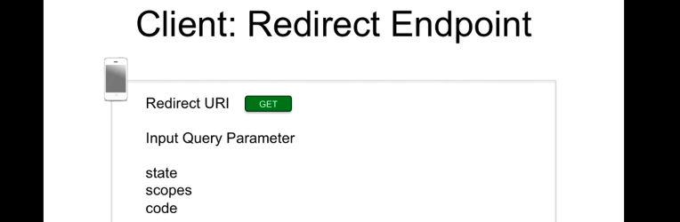
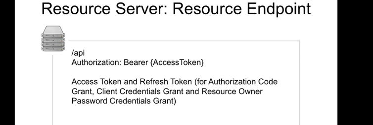

# 03. Les `Endpoints` de `OAuth`

> `Grant` dans le contexte de `OAuth` doit être compris comme `autorisation` ou `autorisation accordée`, `autorisation attribuée`.

## `Authorization` endpoint

Fournit par le `OAuth Server`.

Est accessible avec le chemin `/authorize` ou `/auth` suivant l'implémentation.

### `state` 
Est optionnel.

Il permet de corréler la requête d'autorisation du `Client` et la réponse de l'authentification du `OAuth Server`.

Cela permet à l'application `Cliente` de vérifier que la réponse est bien corrélée (associée) à la requête initiale.

Ce mécanisme permet de prévenir les attaques de type `CSRF` (Cross-Site Request Forgery).

### `scope` 

Est optionnel.

Il spécifie le type de `resource` demandées par le `Client`.

### `response_type`

Est obligatoire.

Spécifie le type de réponse que l'on souhaite avoir : `Authorization Code` pour l'`authorization code flow` et  `Access Token` pour l'`implicit flow`.

### `client_id`

Est obligatoire.

C'est l'identifiant du `Client`.

### `redirect_uri`

Est obligatoire.

C'est l'adresse du `endpoint` à laquelle le résultat de l'`authorize endpoint` doit être envoyé.

Les données en sortie sont transmises par les `query parameters` de la `redirect_uri`.

Ils sont `URL encoded` et placé à la fin de l'`uri` de `redirect`.

Ces données sont soit un `Authorization Code` soit un `Access Token`.

## `Token` endpoint

Fournit par le `OAuth Server`.

Les paramètre sont des paramètres de `form`.

### `grant_type`

Indique si on a `client credentials`, `authorization code` ou `resource owner password credentials`. Ce sont donc différents types d'`autorisation`.

### `code`

Obligatoire.

Dépend du `grant_type` choisi.

### `Output`

`Access Token` et `Refresh Token` pour :

- `Authorization Code Grant` (autorisation par code d'autorisation)
- `Client Credentials Grant`
- `Resource Owner Password Credentials Grant`

Seul `Implicit Grant` n'utilise pas le endpoint `/token`.

## `Redirect` endpoint

Fournit par le `Client`.

C'est un `endpoint` où on renvoie des informations depuis le serveur `OAuth` vers le `Client`.

Le `code` sera utilisé pour obtenir un `Access Token` auprès du `/token endpoint` .

## `Resource` endpoint

Fournit par le `Resource Server`.

C'est le `endpoint` qui vous autorise l'accès à la `resource`.

Le `endpoint` est protégé par `authorization: Bearer` ainsi que l'`Access Token`.

## Confidentialité

Il est impératif de garder les `Tokens` secrets, l'utilisation exclusive de `Transport Layer Security TLS` est obligatoire pour toutes les communications.

