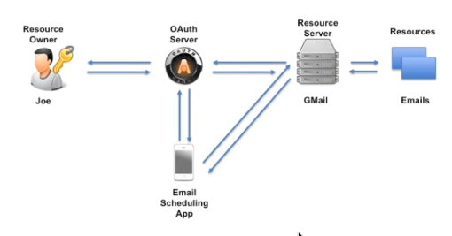
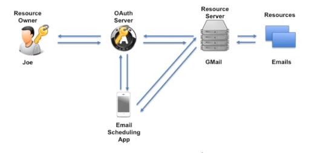
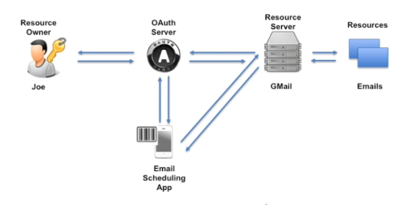
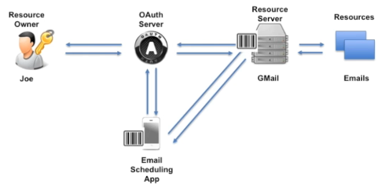
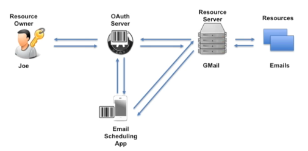
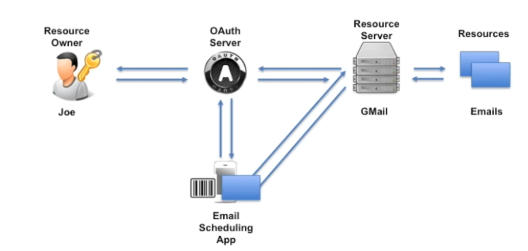
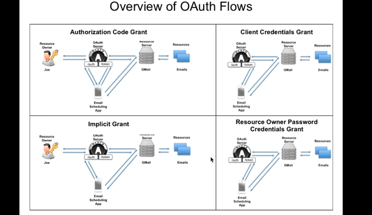

# 05 `OAuth Flows`

Dans un premier temps l'application `Client` contact le `OAuth Server` en précisant le `scope`, par exemple je voudrais accéder aux `email`.

Il peut y avoir des informations annexe comme le `state` (sorte d'identifiant de requête).

Le `OAuth Server` se charge ensuite d'authentifier le `Resource Owner` en le redirigeant vers une page de `login`.

Le `Resource Owner` entre ses `Credentials` et le `OAuth Server` se charge de les vérifier et d'authentifier le `User`. Il peut contacter un `Identity Provider` pour ça.

En cas de succès, l'`OAuth Server` créé un `Authorization Code` et le renvoie au `Client`.

C'est un nombre aléatoire sans sens particulier (comme un `Code Barre`) mais dont le sens est contenu dans la `DB` de l'`OAuth Server`.

Si le `Client` a déjà reçu un `Access Token` (`Implicit Flow`), il peut l'envoyer vers le `Resource Server` pour obtenir la `Resource` souhaitée.

Le `Resource Server` ne sait pas si ce `Token` est valide ou non, seul le `OAuth Server` peut le savoir. 

Le `Resource Server` va donc envoyer le `token` vers le `OAuth Server`. Celui-ci va vérifier si tout est correcte et si c'est le cas va renvoyer que l'accès est `Ok`.

Le `Resource Server` va alors dans sa `DB` et renvoie la `resource` demandée par le Client.

Le `Client` a maintenant accédé la `resource` qu'il souhaitait.

Pour chaque `OAuth Flow` il ya un `OAuth Grant Type`.

> `Grant Type` = `Type d'attribution` / `Type d'Octroi`

## Philosophie

Les `OAuth Flows` fournissent un haut niveau de sécurité en vérifiant l'identité de tous les acteurs `OAuth` impliqués.

Les `flows` vont définir des `règles` d'interactions entre les différents acteurs.

## `4` types de `Flows`

On définie `4` types de `Flows` :

1. ### `Authorization Code Flow` 

    `Three Legged OAuth`. 

   C'est le `Flow` par défaut de `OAuth` et aussi le plus sécurisé `OAuth Flow`. Le prérequis pour ce `Flow` et que le `Client` puisse stocker de manière sécurisée  le `ClientId` et le `ClientSecret`. Les autres `Flows` sont des versions simplifiées de ce `Flow`.

2. ### `Implicit Flow`

   Ce `flow` est utilisé lorsque le `Client` ne peut pas stocker de manière sécurisée un `ClientId`, un `ClientSecret` ou un `OAuth Token`. (Par exemple `Client JS` dans le navigateur ou `Blazor Wasm`).

3. ### `Client Credentials Flow`

   `Two Legged Auth`

   Est appliqué lorsque le `Client` est aussi le `Resource Owner`.

4. ### `Resource Owner Password Credential Flow`

   Le `Client` demande lui-même les identifiants (`Credentials`) du `User`.

