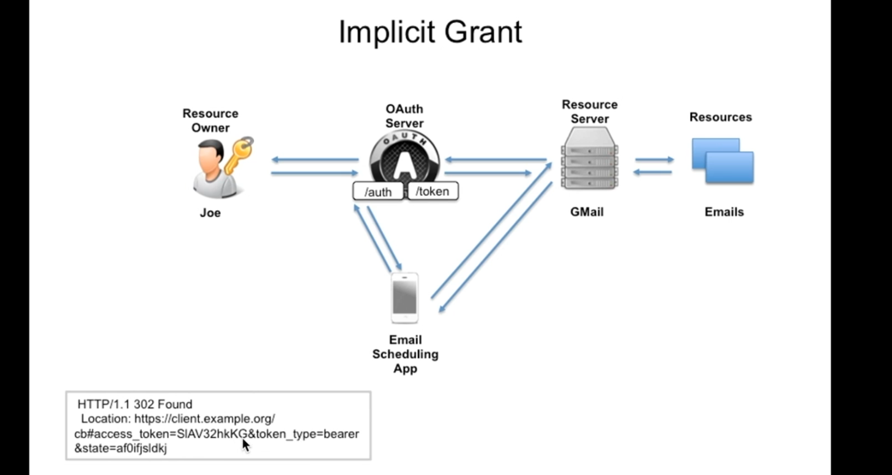
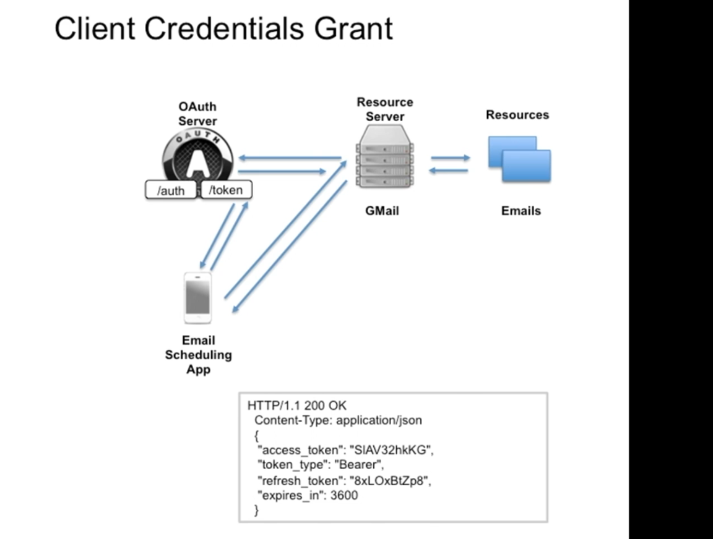
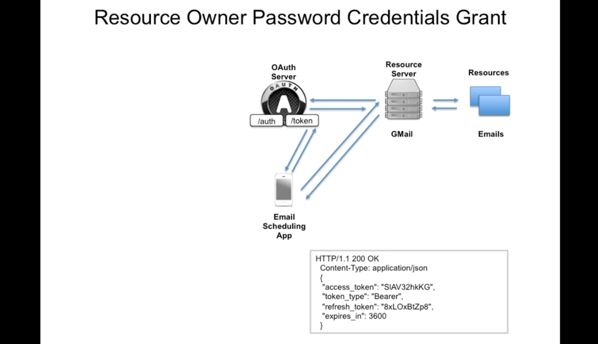

# 07. Les autres `Flows`

## `Implicit` flow

C'est une version simplifié du `Authorization Code Flow` pour les `SPA` ne pouvant pas garder un `secret`.

Il n'y a qu'un seul `endpoint`, le `/authorize` qui renvoie directement un `Access Token` et non plus un `Access Code`.

Comme le `Client` n'est pas authentifié dans ce scénario, l'`Access Token` a une période de validité très courte.

## `Client Credential Flow`

N'utilise que le `/token` endpoint. IL n'a pas besoin que le `Resource Owner` s'authentifie.

Dans ce cas le `Client` et le `Resource Owner` sont en quelque sorte fusionnés, c'est la même chose.

Les seuls `credentials` sont donc `ClientId` et `ClientSecret`.

Le `Client` doit pouvoir les stocker de manière sécurisé (pas de `spa` javascript).

Un `access Token` et un `Refresh Token` sont ici tout deux renvoyés.

## `Resource Owner Password Credentials` flow

Le prérequis de ce `flow` et que le `Resource Owner` partage ses `credentials` avec le `Client`. Le `Client` peut directement utiliser le `username` et le `password` du `User`.

Ce `flow` rappelle le `password anti-pattern` .

Le `Client` et le `Resource Provider` peuvent appartenir à la même compagnie, `Dropbox` et `Dropbox Mobile App` par exemple.

Il est important dans ce flow que le `Client` ne stocke jamais les `credentials` du `Resource Owner`.

Un stockage sécurisé pour l'`Access Token` et le `Refresh Token` est obligatoire pour ce `Flow`.

Ce `flow` est plus simple mais moins sécurisé, rien n'empêche le `Client` de sauver les `credentials` du `User`.

