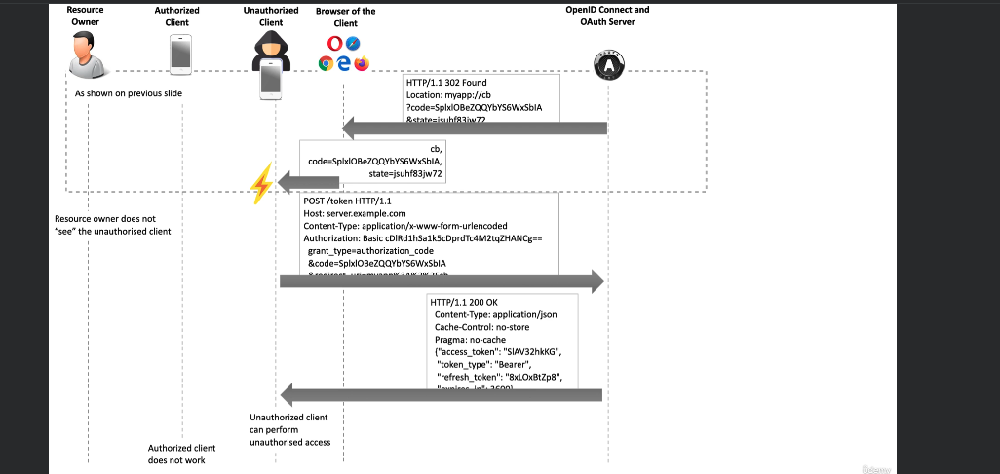

# 08. Proof Key for Code Exchange `PKCE`

Prononcez `Pixi`.

## Introduction

`Proof Key for Code Exchange` est utilisé avec le `Authorization Code Grant` pour les `public OAuth Client` comme les application cliente en `JS`.

Les `Public OAuth Clients` sont susceptibles de subir des `authorization code interception attack`, c'est aussi vrai pour les applications mobile.

> `PKCE` devrait être implémenté pour n'importe quel `Authorization Code Grant` qu'on implémente car il améliore la sécurité.

## `Authorization Code` interception attack

Le point vulnérable pour effectuer l'attaque est de trouver un chemin qui n'est pas protéger par `TLS` (`Transport Layer Security`).

L'attaquant intercepte l'`Authorization Code` et avec celui-ci récupère un `Access Token`.

Le `Client` remarque qu'il ne reçoit pas l'`Authorization Code`, pense que c'est une erreur et en redemande simplement un autre.

Cette attaque est très difficile à détecter pour le `Client`.

## Conditions pour l'attaque

- L'attaquant doit pouvoir enregistrer l'`URI scheme protocol` utilisé par le `Client` attaqué.
- Le `OAuth Authorization Code Flow` est utilisé
- L'attaquant récupère les `ClientId` et `ClientSecret` du `Client` attaqué, par exemple en désassemblant le binaire (ou juste les lire dans le cas du `javascript`).

## Comment l'attaque fonctionne

Le développeur enregistre son application `Client` auprès du `OAuth Server` et fournit la `redirectURI`. 

En retour le développeur du `Client` reçoit un `ClientId` et un `ClientSecret`. Il met toutes ces infos dans le code de l'application `Client`.

L'attaquant télécharge l'app `Client` et dé-compile le code, il obtient le `ClientId`, le `ClientSecret` et le `redirectURI`.

À cee moment l'attaquant ne sait pas pour autant avoir un `Authorization Code` car avec `Authorization Code Grant`, les `credentials` du `Resource Owner` sont nécessaire.

Dans une application mobile, il se passe un `local redirect` après l'authentification du `Resource Owner` sur le navigateur. Cette redirection utilise un protocole `Custom Scheme` pour retourner la réponse vers une application bien précise. Cette communication n'est pas cryptée, elle n'utilise pas `TLS`, c'est ici que se situe le point faible.

L'authentique `Client` est installé par le `resource Owner` et lors de sa première utilisation ou installation, il enregistre son protocole (`scheme`) `myapp` auprès de l'`OS mobile` pour lui dire de renvoyer vers lui quand cette adresse de redirection est utilisée.

L'application malicieuse de l'attaquant fait la même chose, mais après l'application `Client` ce qui écrase son premier enregistrement.

Le `Resource Owner` utilise le `Client`, celui-ci va sur le navigateur l'ouvre et pointe vers `authorization endpoint` du `OAuth server`

Le `ClientId` est passé dans la requête `GET`.

Le `User` se connecte et et accorde son consentement.

Le `OAuth Server`  retourne alors le `Authorization Code` à l'adresse de `redirectURI`.

Comme l'application malicieuse est la dernière à s'être enregistrée, le `Os mobile`/`navigateur` redirige vers elle l'`Authorization Code`.

Maintenant le `hacker` a tout ce qu'il lui faut : `ClientId`, `ClientSecret` et `Authorization Code`, il peut demander un `Access Token`.

Le `Resource Owner` ne voit rien se passer sur l'application `Client`, pendant ce temps l'application malicieuse récupère `Access Token`.

Maintenant cette application malicieuse peut accéder aux `resources` au nom du `Resource Owner` et faire ce qu'elle veut.