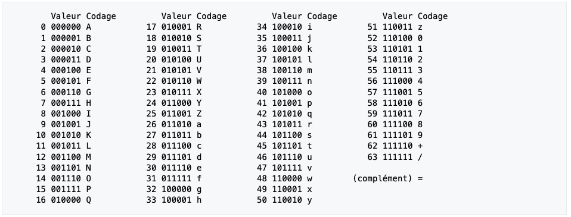
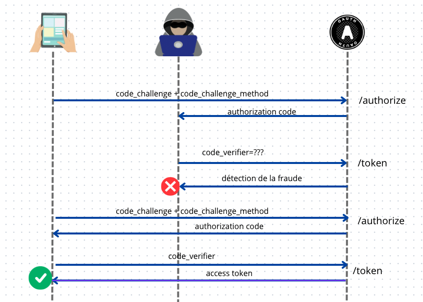
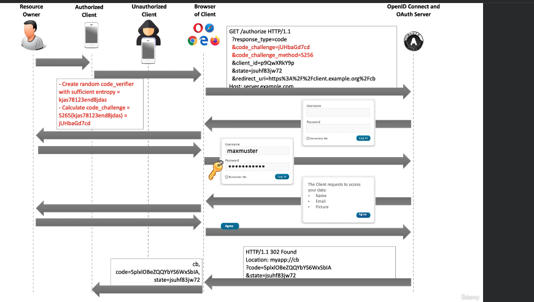
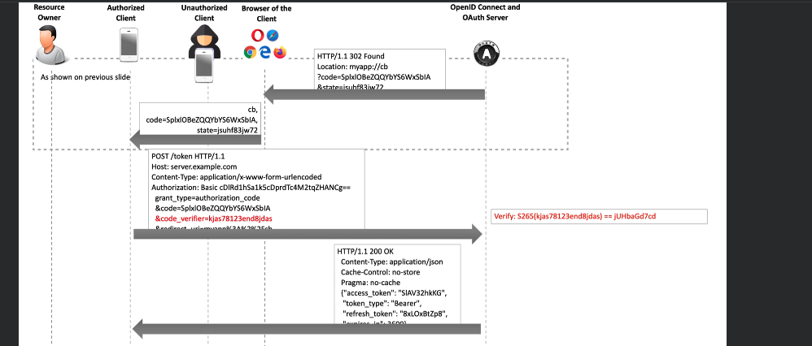

# 09. La solution `PKCE`

Proof Key for Code Exchange

`PKCE` est basé sur une solution `cryptographique` utilisant le `hashage`.

> Le hashage, en revanche, est une technique spécifique utilisée en cryptographie pour produire une valeur de hachage (ou "hash") à partir de données brutes de taille arbitraire. Cette valeur de hachage est généralement de taille fixe et est calculée de manière déterministe à partir des données d'entrée. Les fonctions de hachage sont conçues pour être à sens unique, ce qui signifie qu'il est difficile (théoriquement impossible pour une bonne fonction de hachage) de retrouver les données d'origine à partir de la valeur de hachage. Les fonctions de hachage sont largement utilisées pour l'intégrité des données, la vérification de l'authenticité des données et d'autres applications cryptographiques.
>
> **ChatGPT**

## Les paramètres de `PKCE`

- `code_verifier` un `string` cryptographiquement aléatoire qui permet de corréler la `authorization request` avec la `token request`.
- `code_challenge` est  un `hash` du `code_verifier`.
- `code_challenge_method` la méthode (l'algorithme) utilisée pour créer le `code_challenge`. Il existe deux méthode, `plain` :

  ```
  code_challenge = code_verifier
  ```

  Cette méthode est seulement utile pour le débbuguage et `s256` voire plus bas.

> ## Base64 (ChatGPT)
>
> 1. Chaque caractère de la chaîne est converti en sa représentation binaire (généralement sur 8 bits, c'est-à-dire un octet).
> 2. Les représentations binaires sont ensuite regroupées en paquets de 6 bits (2^6 = 64).
> 3. Chaque paquet de 6 bits est converti en un nombre entier compris entre 0 et 63, qui correspond à un caractère dans la table des caractères Base64.
> 4. Les caractères correspondants sont concaténés pour former la chaîne Base64 finale.
>
> 
>
> Cette représentation Base64 est souvent utilisée pour représenter des données binaires sous forme de texte, ce qui la rend utile dans de nombreux contextes, notamment lors de la transmission de données sur des protocoles qui ne prennent en charge que les données textuelles, comme l'e-mail ou certains formats de fichier web.
>
> Il existe une version où les `+` et les `/` sont respectivement remplacé par `-` et `_` pour être compatible avec la syntaxe des `URL` : c'est `Base64Url` 


## Algorithme pour le `code_challenge` : `s256`

```
code_challenge = BASE64URL-ENCODE(SHA256(ASCII(codee_verifier)))
```

`SHA256` est un algorithme de `hashage` qui prends une chaine de n'importe quelle taille et retourne une séquence de 256bits. C'est un algorithme irréversible et avec une répartition des valeurs équilibrée.


## Comment fonctionne `PKCE`



Le `Client` créé un `code_verifier` pour chaque requête d'`Authorization`.

Le `Client` calcule le `code_challenge` en appliquant la `code_challenge_method` sur le `code_verifier`.

Le `Client` envoie le `code_challenge` et la `code_challenge_method` dans toutes ses requêtes vers `Authorization endpoint`.

Le `Client` envoie le `code_verifier` au `Token endpoint`.

Le `Token endpoint` applique la `code_challenge_method` reçue précédemment sur le `code_verifier` et compare au `code_challenge` reçu plus tôt.




## Retour vers le `Client` autorisé



Le `Client` envoie dans sa requête `POST` vers le `/token endpoint` le `code_verifier` et le serveur `OAuth` possédant le `code_challenge` et la `code_challenge_method` peut vérifier la validité de celui-ci.

Si cela correspond on continue, sinon le `OAuth flow` s'arrête ici.


## Que se passe-t-il avec un `Unauthorized Client`

Le `Client` non autorisé ne connaît pas le `code_verifier`, il ne paartage pas de mémoire avec le vrai `Client`.

Il n'envoie donc pas un `code_verifier` valide et le serveur `OAuth` stoppe le `OAuth Flow`.


