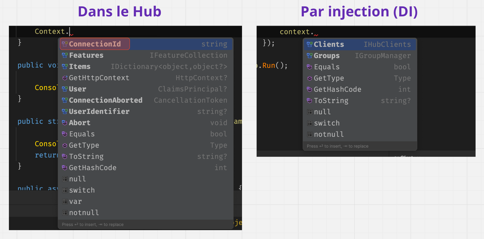
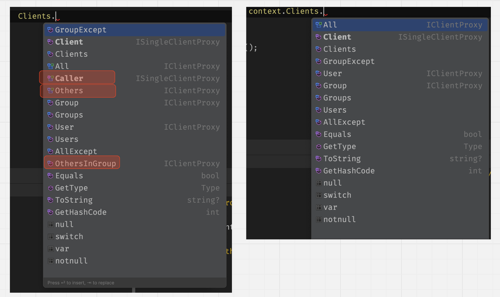

# BB Memento de `SignalR ` Server


## Mise en place

```cs
builder.Services.AddSignalR();

app.MapHub<ViewHub>("/viewhub");
```


## Création d'un `Hub`

```cs
public class ViewHub : Hub
{
    public async Task MaMethodUne() { }
    
    public async Task MaMethodDeux() { }
}
```


## Méthode du `Hub`, accès à Clients

```cs
public async Task SendMessage(int userId, string message)
{
    await Clients.All.SendAsync("ReceiveMessage", userId, message);
}
```


### méthode renvoyant une valeur

```cs
public string CompleteName(string firstName, string lastName){
    string completeName = $"El {firstName} O'{lastName}";

    return completeName;
}
```


### accès aux `Clients`

```cs
public async Task MyHubMethod(string connectionId) {

    await Clients
        .GroupExcept("mygroup", connectionId)
        .SendAsync("clientMethodName", arg1, arg2);
}
```

`All`, `Caller`, `others` tout le monde, l'appelant ou les autres

`Client`, `Clients` une ou plusieurs `connectionId`

`AllExcept` tout le monde sauf une ou plusieurs `connectionId`

`Group`, `Groups`, `GroupExcept`

 `OthersInGroup` exclu l'appelant du groupe

`User`,  `Users` des `user` spécifiques

Toutes ces propriétés possède `InvokeAsync`.


## `DI` dans un `Hub`

```cs
public class MyHub(CitationService service) : Hub
{
    public void DisplayCitation() {
        Console.WriteLine(service.GetCitation());
    }
}
```

Ou bien directement dans la méthode du `Hub` :

```cs
public void DisplayCitation(CitationService service) {
    Console.WriteLine(service.GetCitation());
}
```


## Envoyer (`send`) de l'extérieur du `Hub` : `IHubContext<T>` (`DI`)

```cs
app.MapGet("/document-name", async (IHubContext<MyHub> context) => {
    await context.Clients.All.SendAsync("DocumentUpdated", "MySuperDocument");
});
```

### Pas de `ConnectionID`



### Les méthodes liées au `connectionId` ne sont pas disponibles dans `Clients` :  `Caller`, `Others`, `OthersExcept`




## `Groups`

### Ajouter à un `group`

```cs
public async Task AddToMyGroup(string myGroupName) {
    await Groups.AddToGroupAsync(Context.ConnectionId, myGroupName);
}
```

### Retirer d'un `group`

```cs
await Groups.RemoveFromGroupAsync(Context.ConnectionId, myGroupName);
```

