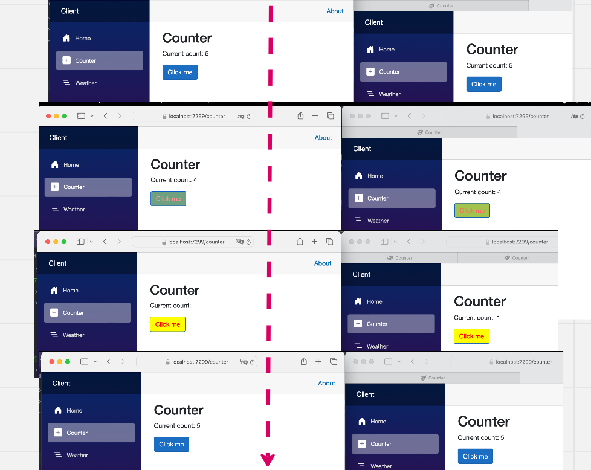

# Exemple avec `Blazor Web App` (`server`)

Les `Hubs` de `SignalR` sont déjà présent dans les applications `asp.net`, par contre il faut ajouter le `Client` :

```bash
dotnet add package Microsoft.AspNetCore.SignalR.Client
```

Dans cette exemple, l'application `Blazor` est à la fois le `Hub` et le `Client`.

## Mise en place `Program.cs`

Ceci est valable pour la partie `Hub`.

```cs
builder.Services.AddSignalR();

app.MapHub<IncrementHub>("/increment-hub");
```


## Création d'un `Hub` : `IncrementHub`

C'est une `classe` héritant de `Hub` :

```cs
public class IncrementHub : Hub
{
    public async Task NotifyIncrement(IncrementMessage message)
    {
        await Clients.All.SendAsync("ReceiveNewIncrement", message);
    }
}
```

Cette `classe` expose ses méthodes au `Client`, celui-ci peut les appeler à distance (`RPC Remote Procedure calls`).

On réponds au `Client` avec `SendAsync` qui déclenche un événement `ReceiveNewIncrement` chez celui-ci. Le `Client` traite l'événement avec une lambda recevant `message` en paramètre.


## Le `message` typé

On peut utiliser ce qu'on veut, ici un `record` :

```cs
public record IncrementMessage(int NewCount);
```


## Utilisation côté `Client` dans un `Component`

### Créer la `connection` : `HubConnectionBuilder`

On doit créer une `connexion` vers le `Hub` :

```cs
protected override async Task OnInitializedAsync()
{
    hubConnection = new HubConnectionBuilder()
        .WithUrl(Navigation.ToAbsoluteUri("/increment-hub"))
        .Build();
```

On utilise l'`URL` fournie à `MapHub`. Ici comment le `Hub` est contenu dans la même application on a juste besoin d'une `URL` relative, sinon on aurait : `.WithUrl(" http://localhost:5071/increment-hub")` par exemple.


### Fournir une `lambda` en réponse au `Hub` avec `On` : `connection.On`

Si on utilise la version générique de `On`, on infére le type du (des) paramètres.

```cs
    hubConnection.On<IncrementMessage>("ReceiveNewIncrement", async (message) =>
    {
        currentCount = message.NewCount;
        buttonClass = "btn btn-primary yellow";
        await InvokeAsync(StateHasChanged);

        await Task.Delay(300);
        buttonClass = "btn btn-primary";

        await InvokeAsync(StateHasChanged);
    });

    await hubConnection.StartAsync();
}
```

J'ai le bouton qui devient jaune lorsque le `count` change.



> ## `StateHasChanged` vs `InvokeAsync(StateHasChanged)`
>
> On utilise directement `StateHasChanged` si la tâche est synchrone et sur le même `Thread` que le `component`.
>
> Si la tâche est asynchrone ou dans une autre `Thread` (`callback`), on utilise `InvokeAsync(StateHasChanged)`.
>
> Ne pas oublier le `await` :
>
> ```cs
> await InvokeAsync(StateHasChanged);
> ```
>
> 

### Appeler le `Hub` : `connection.SendAsync`

```cs
private async Task IncrementCount()
{
    currentCount++;

    if (hubConnection is not null)
    {
        await hubConnection.SendAsync("NotifyIncrement", new IncrementMessage(currentCount));
    }
}
```


## Code complet du composant

```cs
@page "/counter"

@using Client.Hubs
@using Microsoft.AspNetCore.SignalR.Client

@inject NavigationManager Navigation

@implements IAsyncDisposable

<PageTitle>Counter</PageTitle>

<h1>Counter</h1>

<p role="status">Current count: @currentCount</p>

<button class="@buttonClass" @onclick="IncrementCount">Click me</button>

@code {
    private int currentCount = 0;
    private HubConnection? hubConnection;
    private string buttonClass = "btn btn-primary";

    protected override async Task OnInitializedAsync()
    {
        hubConnection = new HubConnectionBuilder()
            .WithUrl(Navigation.ToAbsoluteUri("/increment-hub"))
            .Build();

        hubConnection.On<IncrementMessage>("ReceiveNewIncrement", async (message) =>
        {
            currentCount = message.NewCount;
            buttonClass = "btn btn-primary yellow";
            await InvokeAsync(StateHasChanged);

            await Task.Delay(300);
            buttonClass = "btn btn-primary";

            await InvokeAsync(StateHasChanged);
        });

        await hubConnection.StartAsync();
    }

    private async Task IncrementCount()
    {
        currentCount++;

        if (hubConnection is not null)
        {
            await hubConnection.SendAsync("NotifyIncrement", new IncrementMessage(currentCount));
        }
    }
    
    public async ValueTask DisposeAsync()
    {
        if (hubConnection is not null) await hubConnection.DisposeAsync();
    }

}
```

