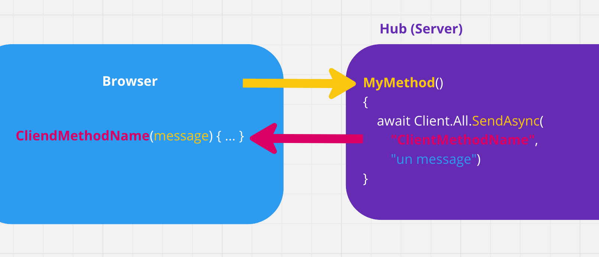

# 00.5 `Hub` et `Client`

Un `Hub` est une classe héritant de la classe  abstraite (`abstract`) `Hub` présente dans `Microsoft.AspNetCore.SignalR` (librairie fournie dans une application `web`).

Un `Hub` est capable de maintenir une `connection` avec ses `clients`.

C'est une communication bi-directionnelle :

Le `Hub` peut recevoir un `message` d'un `client`.

Il peut aussi envoyer un `message` à tous les `clients`.

Les `Hub` font partis de toutes les applications `Asp.Net` du moment qu'elles soient `server-side`.

## Remote Procedure Call : `RPC`

`SignalR` utilise le principe de `RPC` pour faire son travail.

Le mot `Procedure` signifie `Method` ou `Function`.

`SignalR` utilise un `Hub Protocol` pour appeler les `méthodes` à distance du `Client` au `Server` ou bien du `Server` au(x) `Client(s)`.

Le `Hub Protocol` utilise `TCP`.

