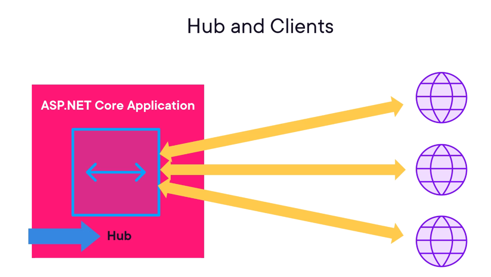
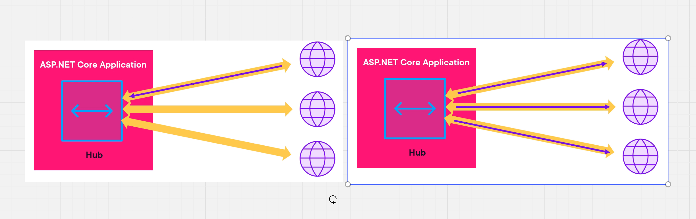

# 00.5 `Hub` et `Client`

Un `Hub` est une classe héritant de `abstract Hub` présent dans `Microsoft.AspNetCore.SignalR` (librairie fournie dans une application `web`).

Un `Hub` est capable de maintenir une `connection` avec ses `clients`.

C'est une communication bi-directionnelle :

Le `Hub` peut recevoir un `message` d'un `client`.

Il peut aussi envoyer un `message` à tous les `clients`.

Les `Hub` font partis de toutes les applications `Asp.Net` du moment qu'elles soient `server-side`.

