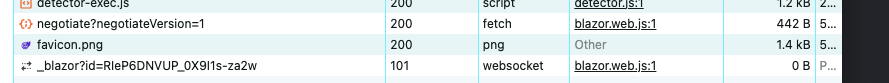

# 01 Transports

Trois moyens de transports :

- WebSocket
- Server Sent Events (SSE) 
- Long Polling (HTTP request avec Timeout en boucle)

Mécanisme de repli permettant d'obtenir une solution de remplacement.

### Désactiver le `fallback mechanism` (mécanisme de repli)



On veut gagner du temps en supprimant la phase de négociation,  car maintenant `WebSocket` est disponible partout.

```cs
connection = new HubConnectionBuilder()
    .WithUrl("http://localhost:5006/update-count", options =>
    {
        options.Transports = HttpTransportType.WebSockets;
        options.SkipNegotiation = true;
    } )
    .Build();
```

On ajoute des options lors de la construction de la connexion.

> ??? Cela n'a pas l'air de fonctionner avec le client `.net` de `SignalR`. ???