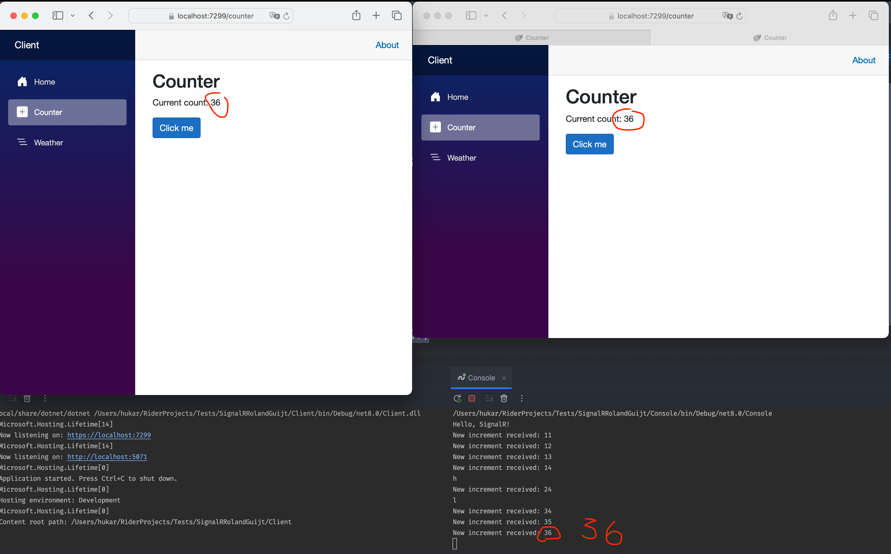

# 02 `Clients`

Le Client peut être de n'importe quel type : `Desktop`, `Web`, `Mobile` ou `Console`.

Ils ne sont pas forcément tous du même type ni de la même technologie (voire disponnibilité du client `SignalR` pour d'autre langages `js`, `java`, ...).

On doit installer le `Client`, pour les technologies `.net` :

```bash
dotnet add package Microsoft.AspNetCore.SignalR.Client
```


## Console `Client`

On peut avoir toutes sortes de `Client SignalR`, par exemple une application console :

```cs
var count = 0;

var connection = new HubConnectionBuilder()
    .WithUrl(" http://localhost:5071/increment-hub")
    .Build();

connection.On<IncrementMessage>("ReceiveNewIncrement", message =>
{
    Console.WriteLine($"New increment received: {message.NewCount}");
    count = message.NewCount;
});

await connection.StartAsync();

var key = "";

while (key != "q")
{
    key = Console.ReadLine();
    await connection.InvokeAsync("NotifyIncrement", new IncrementMessage(count + 10));
}

await connection.DisposeAsync();
```



Les deux onglets ainsi que la `console` sont synchronisés.