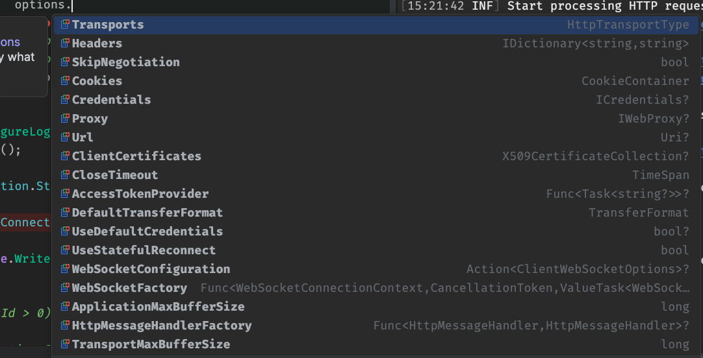
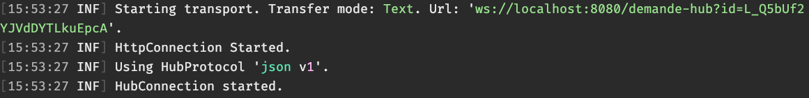
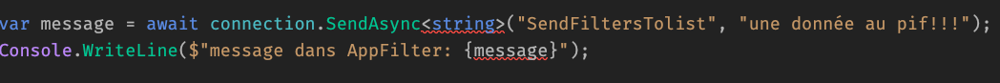

# 02 `Clients`

Le Client peut être de n'importe quel type : `Desktop`, `Web`, `Mobile` ou `Console`.

Ils ne sont pas forcément tous du même type ni de la même technologie (voire disponnibilité du client `SignalR` pour d'autre langages `js`, `java`, ...).

On doit installer le `Client`, pour les technologies `.net` :

```bash
dotnet add package Microsoft.AspNetCore.SignalR.Client
```


## Console `Client`

On peut avoir toutes sortes de `Client SignalR`, par exemple une application console :

```cs
var count = 0;

var connection = new HubConnectionBuilder()
    .WithUrl(" http://localhost:5071/increment-hub")
    .Build();

connection.On<IncrementMessage>("ReceiveNewIncrement", message =>
{
    Console.WriteLine($"New increment received: {message.NewCount}");
    count = message.NewCount;
});

await connection.StartAsync();

var key = "";

while (key != "q")
{
    key = Console.ReadLine();
    await connection.InvokeAsync("NotifyIncrement", new IncrementMessage(count + 10));
}

await connection.DisposeAsync();
```


Les deux onglets ainsi que la `console` sont synchronisés.


## `HttpConnectionOptions`

On a accès à des `options` de configuration lors de la création de notre `HUbConnection` :

```cs
Connection ??= new HubConnectionBuilder()
    .WithUrl("http://localhost:8080/demande-hub"
        , options =>
        {
            options.Transports = HttpTransportType.WebSockets;
            options.SkipNegotiation = true;
            options.Headers.Add("Utilisateur-Id", "2");
        }
    )
    .Build();
```

On peut forcer le protocole de `Transport` avec `HttpTransportType.WebSockets`.

On peut sauter la phase de négociation avec `SkipNegociation`, mais attention dans ce cas on ne reçoit plus le `connectionId`.

On peut aussi ajouter des `headers` à la requête `GET` qui initie la `connection` de `SignalR`.




## Ajouter `Serilog` à la `Connection` : 

### `ConfigureLogging(c => c.AddSerilog())`

```cs
Connection ??= new HubConnectionBuilder()
            .WithUrl("http://localhost:8080/demande-hub"
                // ...
            )
            .ConfigureLogging(c => c.AddSerilog())
            .Build();
```




## `InvokeAsync` et `SendAsync`

### `InvokeAsync` permet de récupérer des données de la méthode appelée dans le `Hub`.

`MyHub.cs`

```cs

public class MyHub : Hub
{
    public string SendMessageToComponent(string something)
    {
       // ...

        return $"Ok mon copain j'ai reçu {something}";
    }
}
```

Dans un composant `client`

```cs
private async Task DoSomething()
{
	// ...

    if (connection is not null)
    {
        var message = await connection.InvokeAsync<string>("SendMessageToComponent", "une donnée au pif!!!");
        Console.WriteLine($"message dans AppFilter: {message}");
    }
}
```

```
message dans AppFilter: Ok mon copain j'ai reçu une donnée au pif!!!
```

Si à la place de `InvokeAsync` j'utilise `SendAsync`, cela génère une erreur de compilation :



### `SendAsync` s'utilise lorsque la méthode du `Hub` ne retourne rien, elle est alors plus performante que `InvokeAsync`.

`MyHub.cs`

```cs
public class MyHub : Hub
{
    public void DoSomethingOnTheHub(string something)
    {
       Console.WriteLine($"on the hub: {something}");
    }
}
```

Dans un composant `client` :

```cs
private async Task DoSomething()
{
	// ...

	if (connection is not null)
    {
        await connection.SendAsync("SendFiltersTolist", "une donnée au pif!!!");
    }
}
```

```
on the hub: une donnée au pif!!!
```


