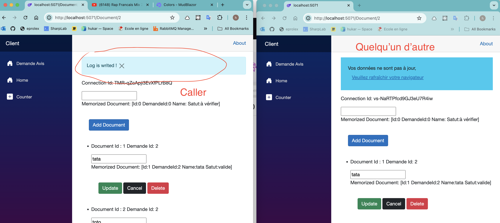
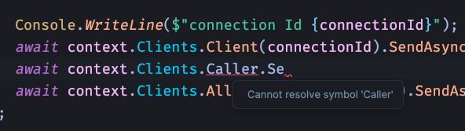

# 03 `HubContext`

À la place d'appeler directement mon `Hub`, je peux placer la logique dans un `endpoint` et renvoyer grâce au `HubContext` un événement aux différents clients `SignalR`.


## Dans le `Server`

### Création d'un `Hub` vide

```cs
public class EnchereHub : Hub
{

}
```

Ajout dans `Program.cs`

```cs
builder.Services.AddSignalR();

app.MapHub<EnchereHub>("enchere-hub");
```


### Utilisation du `Hub` grâce à `IHubContext` dans les `Endpoints`

On peut injcter dans un `endpoint` directement le `HubContext` pour accéder au `Hub` :

```cs
(IHubContext<EnchereHub> context) => { ... }
```


### `All`, `Client(connectionId)`, `AllExcept(connectionId)`

`All` déclenche l'événement dans tous les `Clients` connectés.

`Client(connectionId)` déclenche l'événement uniquement dans le `Client` correspondant à la `connectionId`.

`AllExcept(connectionID)` déclenche l'événement dans tous les `Clients` sauf celui désigné par la `connectionId`.


```cs
group.MapPut("/update/{connectionId}", async (
    Document documentToUpdate, 
    DocumentRepository repo,
    IHubContext<DocumentHub> context,
    string connectionId) =>
{
    var rowsAffected = repo.Update(documentToUpdate);
    
    if(rowsAffected == 0)
    {
        await context.Clients.
            Client(connectionId).
            SendAsync(DocumentEvent.NotFound, documentToUpdate.Id);
        
        return NotFound();
    }

    await Task.Delay(600);
    Console.WriteLine("document updated");

    await context.Clients.
        Client(connectionId).
        SendAsync(DocumentEvent.Updated, documentToUpdate);
   
    await context.Clients
        .AllExcept(connectionId)
        .SendAsync(DocumentEvent.ChangeNotifyed);
    
    return NoContent();
});
```


## `Caller`

Depuis un `Hub` on peut communiquer seulement avec l'utilisateur appelant : le `Caller` :

```cs
public class DocumentHub : Hub
{
    public async Task LogDocument(Document documentToLog)
    {
        // ...

        await Clients.Caller.SendAsync(DocumentEvent.LogWrited);
    }
}
```

Ici seul le `Caller` recevra l'événement `DocumentEvent.LogWrited` :



Le `Caller` est accessible uniquement dans le `Hub`, si on tente d'y accéder ailleurs, il n'est pas présent :



Cela oblige à envoyer le `connectionId` et l'utiliser comme ceci :

```cs
await context.Clients.Client(connectionId).SendAsync("DocumentAdded", document);
```

