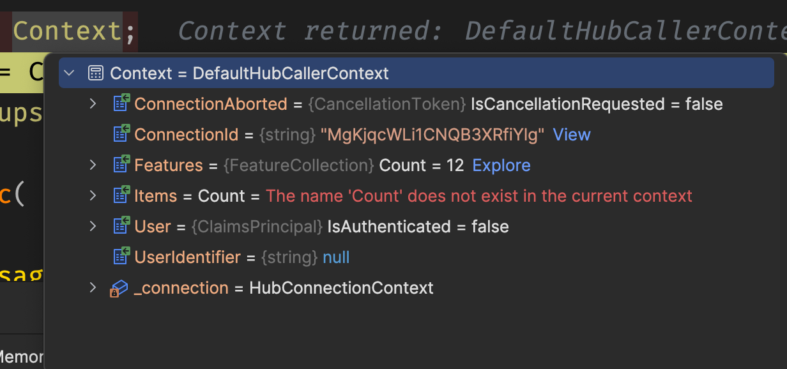
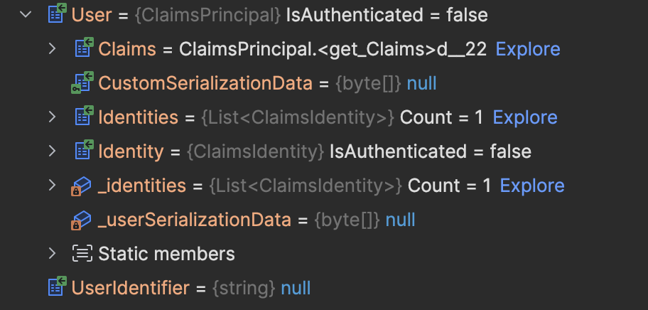
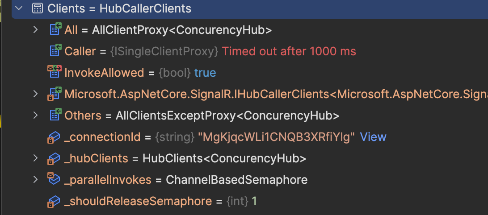
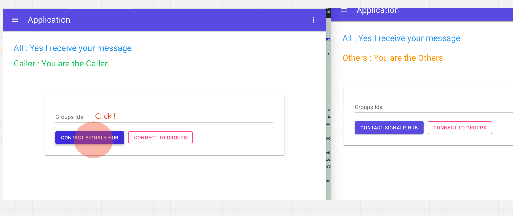
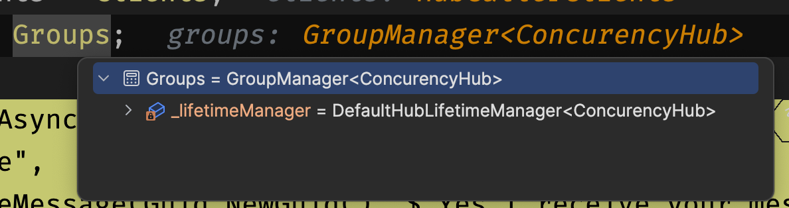

# 03 Le `Hub`

## Mise en place

Dans `Program.cs`

```cs
builder.Services.AddSignalR();

app.MapHub<EnchereHub>("/document-hub");
```


## Anatomie

Je peux construire un `hub` en héritant de `hub` :

```cs
public class DocumentHub : Hub
{
    // ...
}
```

On a accès aux propriétés `Context`, `Clients` et `Groups`.

On peut aussi `overrider` les méthodes  `OnConnectedAsync` et `OnDisconnectedAsync`.

```cs
public class DocumentHub : Hub
{
    public async Task AddToGroup()
    {
        // ...
    }

    public override Task OnConnectedAsync()
    {
        // ...
    }
}
```


## Disponible dans les `méthodes` du `Hub`

```cs
public class ConcurencyHub : Hub
{
    public async Task CreateGroup(RequestGroupIdMessage message) {

        HubCallerContext context = Context;
        IHubCallerClients clients = Clients;
        IGroupManager groups = Groups;
```

### `Context`



On a principalement le `ConnectionId` et un `User` pour gérer les `authentifications` et les `autorizations` :




### `Clients`



`All` tous les `clients` connectés.

`Caller` le client envoyant le message au `hub`.

`Others` tous les autres sauf le `Caller`.

On peut choisir de contacter l'une de ses trois options :

```cs
await Clients.All.SendAsync(
    "ForAllMessage", 
    "Yes I receive your message"
);

await Clients.Caller.SendAsync(
    "ForCallerMessage", 
    "You are the Caller"
);

await Clients.Others.SendAsync(
    "HubReceivedOthersMessage", 
    "You are the Others"
);
```




### `Groups`




