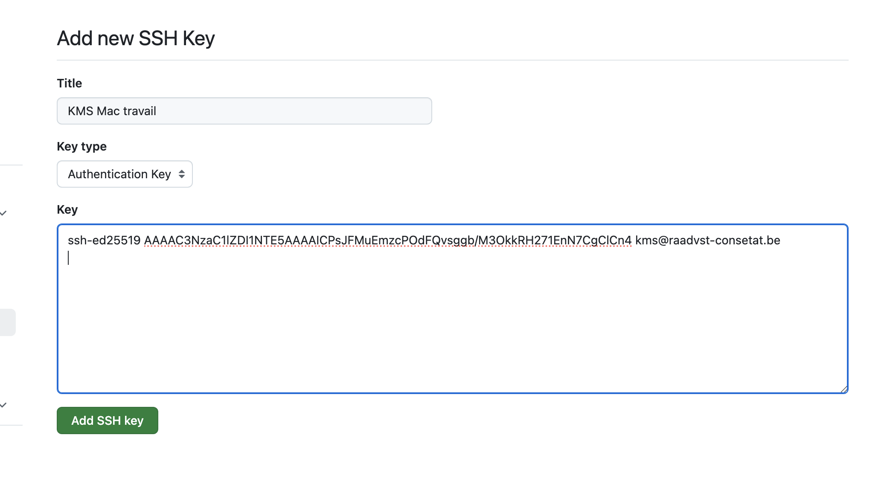

# 06. Gérer les accès avec `SSH`

## Vérifier si il y a déjà une clé `ssh`

```bash
ls -al ~/.ssh
```


## Générer une nouvelle clé

```bash
ssh-keygen -t ed25519 -C "your_email@example.com"
```


Une invite de commande vous propose d'entrer le nom du fichier généré et une phrase de sécurité. Dans mon cas j'appuie trois fois sur `entrée` pour le nom de fichier par défaut `.ssh/id_ed25519` et pas de `passphrase`.

On a maintenant les deux clés public et privée dans le dossier `.ssh` :

```bash
ls
id_ed25519      id_ed25519.pub
```


## Création du fichier `config`

```bash
touch ~/.ssh/config
```

```bash
pico ~/.ssh/config
```

```
Host github.com
  UseKeychain yes
  IdentityFile ~/.ssh/id_ed25519
```


## Ajout de la clé privée à `ssh-agent`

```bash
exec ssh-agent zsh
```

```bash
ssh-agent
SSH_AUTH_SOCK=/var/folders/vx/5w1xqp6j0w5b0kpl8hhjpgjc0000gn/T//ssh-c5rApH2zCXNo/agent.95775; export SSH_AUTH_SOCK;
SSH_AGENT_PID=95776; export SSH_AGENT_PID;
echo Agent pid 95776;
```

on voit qu'il tourne sur le processus `95776`.

> Attention on peut lancer plusieurs instance de `ssh-agent`.
>
> Pour vérifier
>
> ```bash
> ps aux | grep ssh-agent
> ```
>
> 
>
> On peut ensuite les arrêter avec `kill`
>
> ```bash 
> kill 96304
> kill 95776
> kill 95635
> ```
>
> Et relancer un unique `ssh-agent`:
>
> ```bash
> eval "$(ssh-agent -s)"
> Agent pid 1870
> ```
>
> 

```bash
ssh-add ~/.ssh/id_ed25519
Identity added: /Users/kms/.ssh/id_ed25519 (kms@raadvst-consetat.be)
```


## Copier la clé public dans le presse-papier

```bash
pbcopy < ~/.ssh/id_ed25519.pub
```

```
ssh-ed25519 AAAAC3NzaC1lZDI1NTE5AAAAICPsJFMuEmzcPOdFQvsggb/M3OkkRH271EnN7CgClCn4 kms@raadvst-consetat.be

```


## Copier la clé public dans `Github`


Clicker sur son icône pour accéder à ses `settings` puis rubrique `SSH and GPG keys`.


Clicker sur `new SSH key` (on remarque qu'il y a déjà une clé)



On copie-colle la clé public (grâce à `pbcopy`)


On a maintenant deux clés public pour deux machines.


## Tester la connexion `SSH`

```bash
ssh -T git@github.com
The authenticity of host 'github.com (140.82.121.4)' can't be established.
ED25519 key fingerprint is SHA256:+DiY3wvvV6TuJJhbpZisF/zLDA0zPMSvHdkr4UvCOqU.
This key is not known by any other names.
Are you sure you want to continue connecting (yes/no/[fingerprint])? yes
Warning: Permanently added 'github.com' (ED25519) to the list of known hosts.
Hi kmsraadvst! You've successfully authenticated, but GitHub does not provide shell access.
```

à ce moment il faut taper `yes`.

```bash
ssh -T git@github.com
Hi kmsraadvst! You've successfully authenticated, but GitHub does not provide shell access.
```

Maintenant tout est OK.


## Utiliser `SSH` avec `Github Desktop`


On renseigne l'`url ssh` à la place de l'`url https`. 

