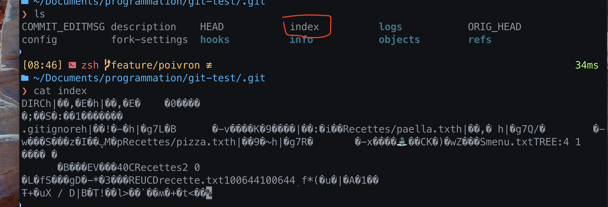

# 01 The `four` areas

- `Stash`
- `Working` area
- `Index`
- `Repository`

## Deux questions importantes

### 1. Comment cette `command` déplace les informations à travers ces 4 endroits ?

### 2. Comment cette `command` modifie le `Repository` ?

## Le `Working` area

C'est le dossier d'un projet sur le `file system`. 

C'est là où on travaille, où on édite les fichiers.

Pour `git` c'est une place temporaire et pas forcement importante.

Une donnée est sauvegardée de manière sûr, seulement si elle est envoyée au `Repository` après un `commit`.

## Le `Repository` : `.git`

Les informations les plus importantes sont dans la `objects database`.

### Les objets de `Git`

Les `blobs` qui représente le contenu des fichiers.

Les `tree` qui représente les dossiers

Les `commits` de `git`

Ces objets sont `immutable`, il peuvent être créés ou supprimés mais jamais modifiés.

Ces objets sont reliés entre aux dans un graphe représentant l'historique du projet.

Ici nous voulons plus parler des `commit` et moins des `tree` et `blob`.

### Une `branch` est une référence vers un `commit`

C'est le point d'entrée d'un historique de `commit`.

### Il ne peut y avoir qu'un `HEAD`

Il pointe sur une `branche`, la `branche` courante.

Cette `branche` pointe elle-même vers un `commit`, c'est le `commit` courant.

Indirectement `HEAD` pointe aussi vers le `commit` courant.

### `Garbage` Collection

Si une `branche` est supprimée, il est possible que certain `commit` ne soient plus atteignables.

`Git` peut alors les supprimer après un certain temps, ils sont `garbage collectés`.

## L'`Index`

L'`Index` est unique à `Git`, ou plutôt `Git` est l'unique système de `versioning` à permettre de le modifier directement.

Les données ne sont pas déplacées directement du `Working area` au `Repository`, elles passent par l'`Index` :

L'`Index` est aussi appelé le `staging area` (`zone de transit`), c'est une `zone` temporaire de préparation.

C'est un fichier binaire à la racine du dossier `.git`:

SI on a un `clean status`, on peut mentalement se representer les trois `zones` comme alignées :

### `git diff`

Par défaut `git diff` compare le `Working Area` avec l'`Index`.

Avec l'option `--cached` c'est l'`Index` et le `Repository` qui sont comparés.

Si on est dans un `clean status` les deux commandes ne retourne rien car les trois zones sont allignées.
