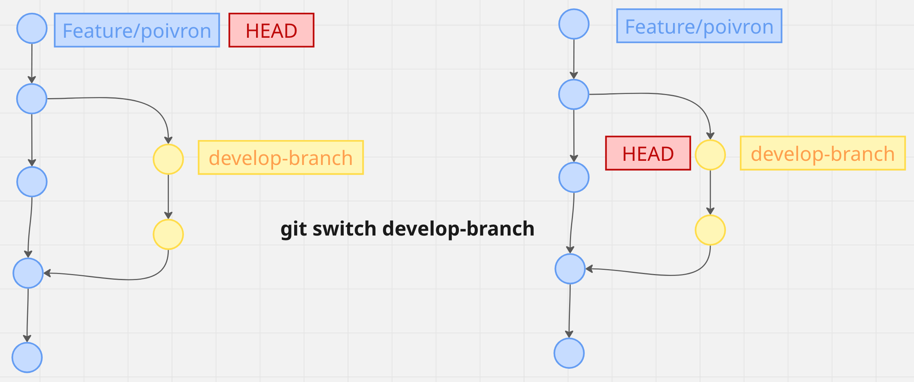

# 02 Basic `workflow`

## Les `2` questions

### Comment cette `command` déplace les informations entre les `4 zones` ?

### Comment cette `command` modifie le `Repository` ?

## Modification d'un fichier

`menu.txt` n'ets plus alligné avec `Index` et `Repository`.

### `git status` nous conseille d'effectuer un `git add`, un `git restore` ou bien un `git commit -a`.

## Déplacer les données vers la droite

`git add` ajoute le fichier à l'`Index` :

`menu.txt` est `staged`, `indexé`.

Si j'execute un `git diff`, j'obtiens une réponse vide.

Par contre si j'exécute la commande `git diff --cached` :

En résumé j'ai la situation :

Maintenant si je fais un `commit`, j'aligne `menu.txt` dans le `Repository`.

`commit` ne se contente pas d'aligner le contenu, il créé un nouveau `commit` et  il déplace la `branch`. `commit` modifie le `Repository`.

On reviens à un `clean status` et `git diff` ou bien `git diff --cached` ne montre rien.

## Déplacer les données vers la gauche

### la commande `switch`

Elle permet de passer d'une `branch` à l'autre.

> `switch ` ne permet de passer que d'une `branch` à une autre, alors que `checkout` permet de se rebdre sur n'importe quel `commit`.

Elle fait deux choses :

1. Dans le `Repository`, elle déplace la réferece  `HEAD`, ce qui change le `current commit`.
2. Elle copie les données dans `Working Area` et `Index`.

Le `HEAD` détermine le `current commit`.

