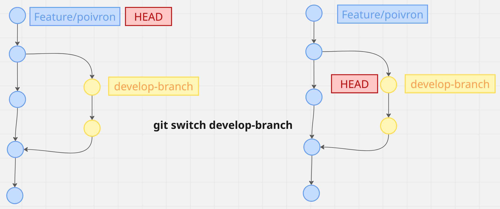
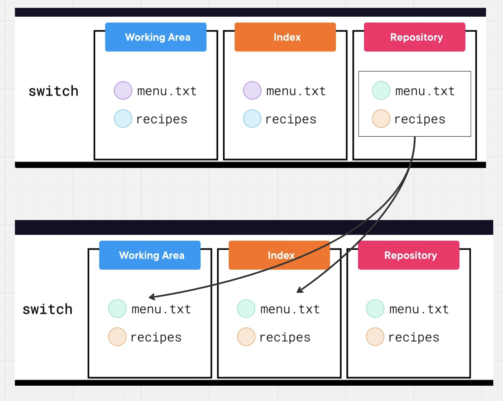
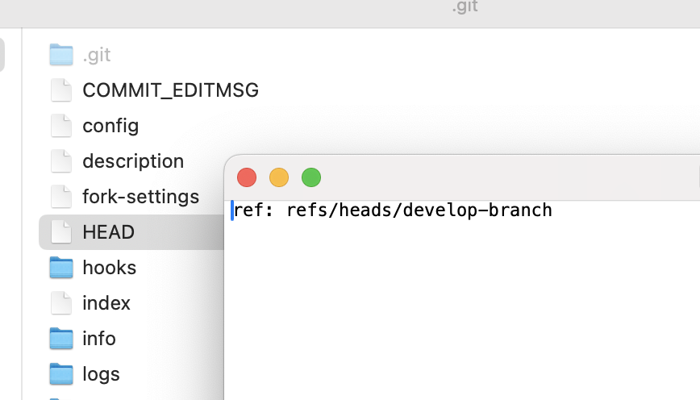
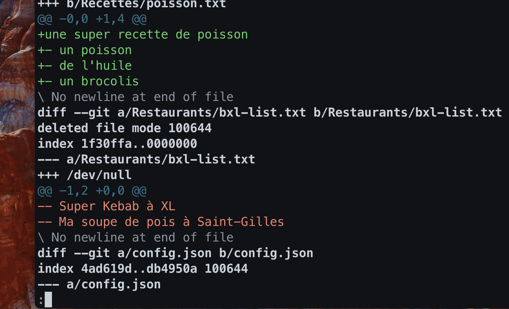

# 03. `switch` Déplacer les données vers la gauche

## la commande `switch`

Elle permet de passer d'une `branch` à l'autre.

> `switch ` ne permet de passer que d'une `branch` à une autre, alors que `checkout` permet de se rendre sur n'importe quel `commit`.

Elle fait deux choses :

1. Dans le `Repository`, elle déplace la réferece  `HEAD`, ce qui change le `current commit`.
   
2. Elle copie les données du `repository` dans `Working Area` et `Index`.
   

Le `HEAD` détermine le `current commit`.



> ## Comparer deux branches : `git diff branch1 branch2`
>
> ```bash
> git diff develop-branch feature/poivron
> ```
>
> 


