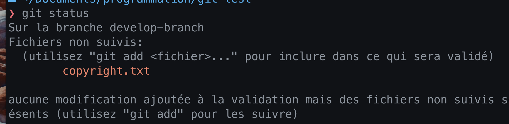
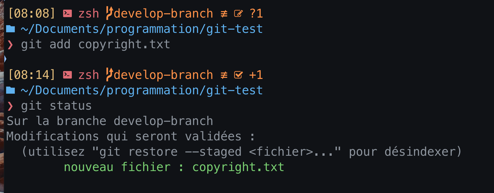
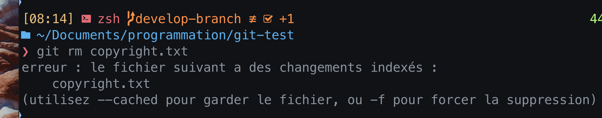
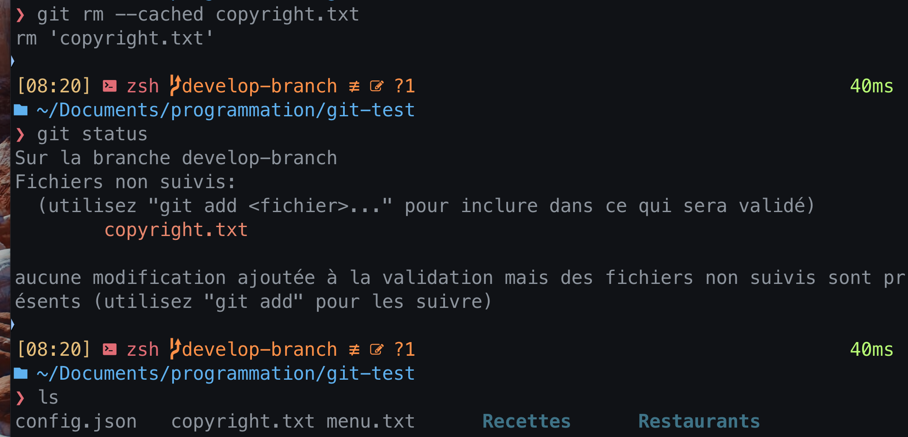
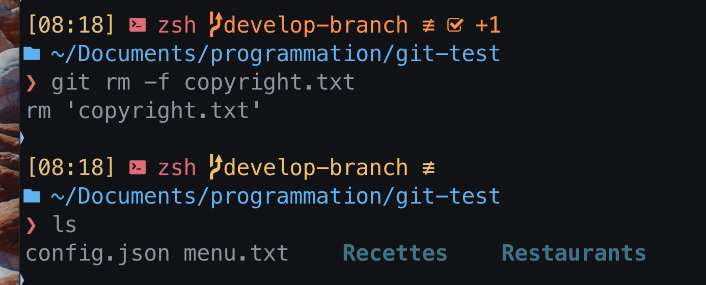
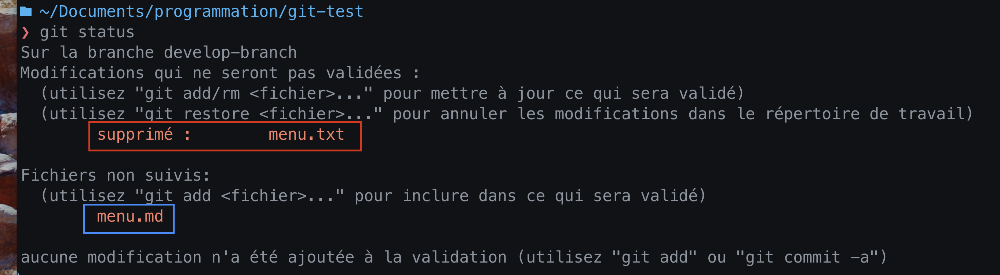
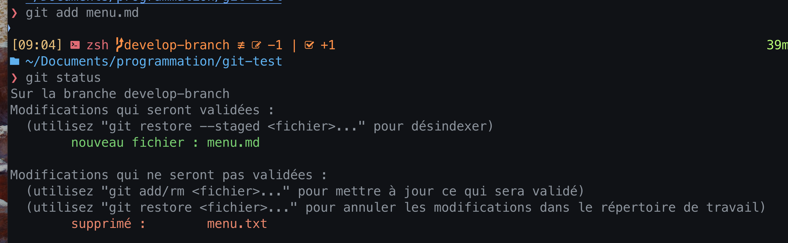
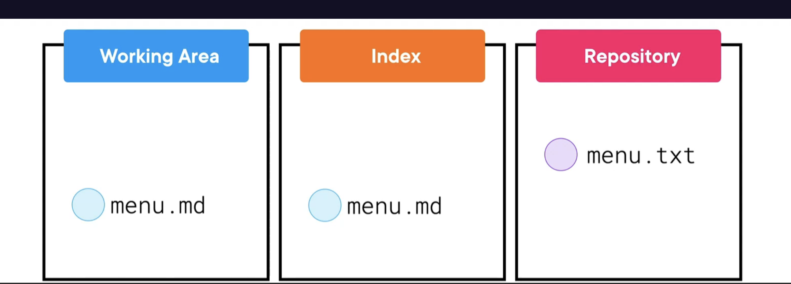
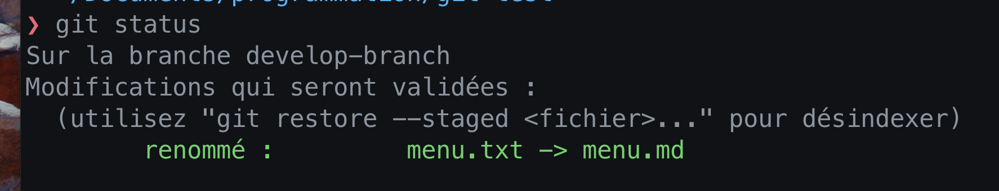
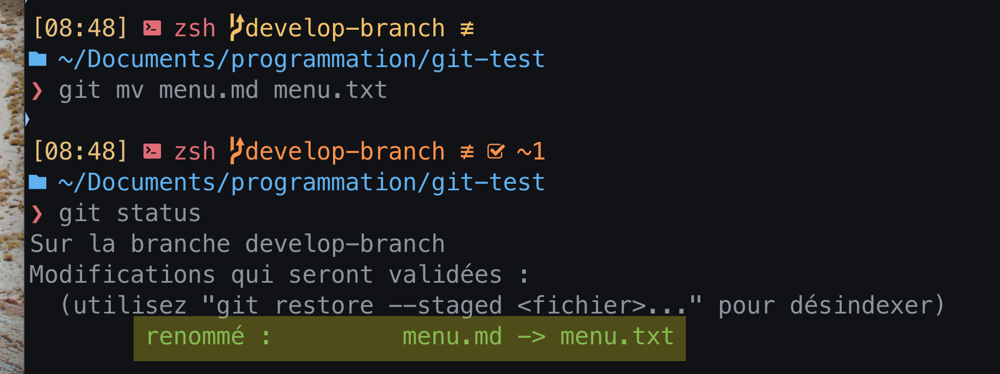

# 04. Supprimer et renommer des `fichiers`

## Supprimers des fichiers `git rm`

On va  d'abord créer un fichier :



Le fichier se trouve uniquement dans le `Working area`, il n'est pas encore indexé.


On doit maintenant faire un `git add` pour l'ajouter à l'`Index` :



Nous avons donc la situation :


### Que faire si l'on veut retirer `copyright.txt` de l'`Index` ? 

### `git rm copyright.txt`



On obtient une erreur car il y a deux options :

`--cached` qui ne supprime pas le fichier mais le retire de l'index



`-f` la version destructive qui supprime le fichier



### La commande opposée à `git add` est `git rm --cached`.


## Renommer des fichiers

Si je renomme un fichier `menu.txt` en `menu.md` :

```bash
mv menu.txt menu.md
```



Pour `Git` c'est l'équivalent à la suppression de `menu.txt` et l'ajout de `menu.md`.


J'ai donc la situation ci-dessus.

Je dois ajouter `menu.md` à l'`index`, car il est `untracked` (non suivis).



On a maintenant une situation comme ceci :


Pour renseigner la suppression de `menu.txt`, il faut maintenant `git add` le fichier `menu.txt` qui est supprimée, et cette suppression va écraser le fichier `menu.txt` de l'`Index`. `Git` met à jour le fichier `menu.txt` de l'`Index` avec celui du `Working area`, c'est à dire avec `rien`.

```bash
git add menu.txt
```



`Git` comprends alors que c'est un renommage de `menu.txt` en `menu.md`.



> ## `git mv`
>
> On peut aussi utiliser `git mv` :
>
> ```bash
> git mv menu.md menu.txt
> ```
>
> 
>
> Cette commande est peut utilisée.


