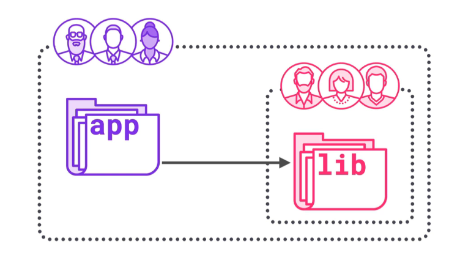
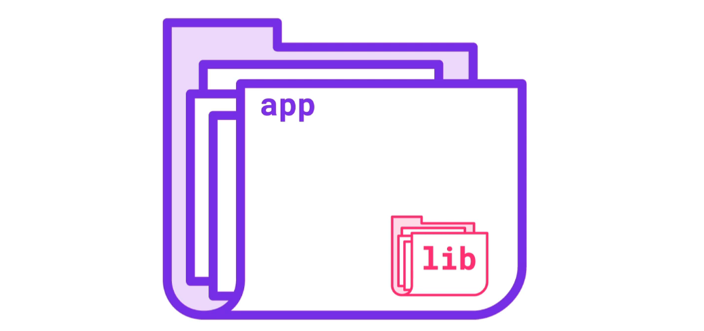

# `Submodules`

## Cas de figure

Gestion de la dépendance entre une application et une librairie.

## Utiliser `Git` pour manager la dépendance entre projet

On souhaite créer une hiérarchie et un lien entre deux projets de façon que le `commit` de l'un corresponde à une version de l'autre.

## Utilisation des `submodules`

