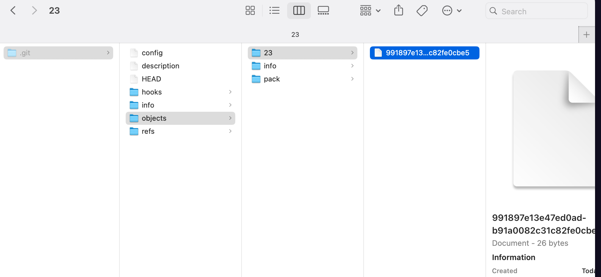

# 00 La plomberie de `Git`

## `Porcelain` commands

```bash
git add
git commit
git push
git pull
git branch
git switch # (git checkout)
git merge
git rebase
```

`git switch` est une version récente remplaçant pour certaine fonction l'ancien `git checkout`. `git checkout` continu de fonctionner.

## `Plumbing` commands (`Plomberie`)

Les briques composants les `Porcelain` commands.

```bash
git cat-file
git hash-object
git count-objects
```


## La base de `Git`

### C'est un stupide `tracker` de contenu

### git - the stupid content tracker

```bash
man git

GIT(1)                            Git Manual                            GIT(1)

NAME
       git - the stupid content tracker
```

C'est un `map` persistant sur le disque, une table associative utilisant un `hash` comme clé.


## `Map` Values and Keys

Les `values` peuvent être n'importe quelle séquence d'octets et la clé est calculée grâce à `SHA-1`, c'est un `SHA-1 hash`.

`SHA` : `Secure Hash Algorithm` c'est une focntion de hachage cryptographique.

`SHA-1` produit une séquence de 20 octets habituellement représen tés par 40 caractères.

> ### ChatGPT
>
> L'aspect `cryptographique` signifie que cet algorithme est conçu pour résister à certaines attaques :
>
> - **Collision** : Il doit être difficile de trouver deux entrées différentes qui produisent la même empreinte.
> - **Préimage** : Il doit être difficile de retrouver l'entrée d'origine à partir de l'empreinte.
> - **Seconde préimage** : Il doit être difficile de trouver une autre entrée qui produit la même empreinte qu'une entrée donnée.


## `git hash-object`

Avec une `command` bas niveau (`plumbery command`) on a :

```bash
echo "Apple Pie" | git hash-object --stdin
23991897e13e47ed0adb91a0082c31c82fe0cbe5
```

Pour obtenir la même chose en `c#` il faut tenir compte que `git` préfixe la chaîne de caractère avec son type et sa taille et que la commande `echo` ajoute un saut de ligne après la chaîne cela donne le code suivant :

```cs
const string str = "Apple Pie\n";
string gitFormatStr = $"blob {str.Length}\0{str}";
// => "blob 9\0Apple Pie\n"

Console.WriteLine(ComputeSha1Hash(gitFormatStr));

string ComputeSha1Hash(string input)
{
    // Convertit la chaîne en un tableau de bytes
    var bytes = Encoding.UTF8.GetBytes(input);

    // Crée une instance de l'algorithme SHA-1
    // Calcule le hachage
    var hashBytes = SHA1.HashData(bytes);

    // Convertit le tableau de bytes en une chaîne hexadécimale
    var sb = new StringBuilder();
    foreach (var b in hashBytes)
    {
        sb.Append(b.ToString("x2"));
    }

    return sb.ToString();
}
```

```
23991897e13e47ed0adb91a0082c31c82fe0cbe5
```

> Un `SHA-1` peut être considéré comme unique dans l'univers et il n'y a pas de risque de collision hasardeuse.


## `Git` est persistant

`Git` enregistre ses objets sur le disque, pour cela il faut initier un dépôt `git` :

```bash
git init
```

On peut maintenant persister notre `map` avec l'argument `-w` de la commande précédente :

```bash
echo "Apple Pie" | git hash-object --stdin -w
```



Dans le dossier `objects` on a maintenant un dossier dont le nom est composé des deux premier caractères du `hash` contenant un fichier dont le nom est lui composé du reste des caractères du `hash` (moins les deux premiers).

Le dossier `objects` est la base de données de `git`.

Le fichier produit est ce qu'on appelle un `blob` de données, `git` lui ajoute un petit `header` et compresse l'ensemble pour gagner de la place.


## `git cat-file`

On ne peut pas juste ouvrir ce fichier `blob`, il faut utiliser une commande spéciale de `git` :

```bash
git cat-file <HASH_OBJECT> -t -p
```

`-t` pour le `type` d'objet

`-p` pour afficher le contenu en retirant le `header`

```bash
git cat-file -t 23991897e13e47ed0adb91a0082c31c82fe0cbe5
blob
```

```bash
git cat-file -p 23991897e13e47ed0adb91a0082c31c82fe0cbe5
Apple Pie
```


