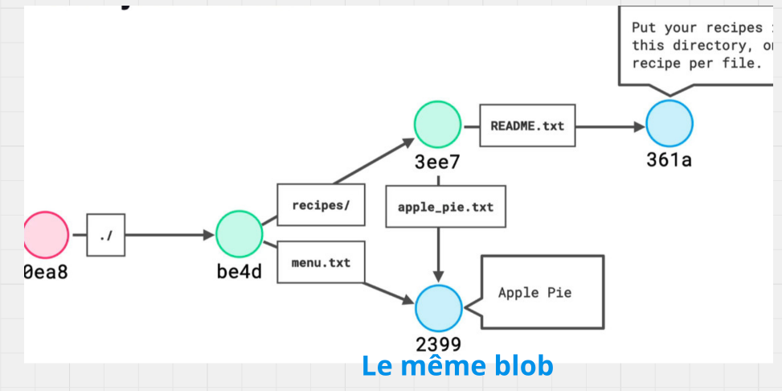
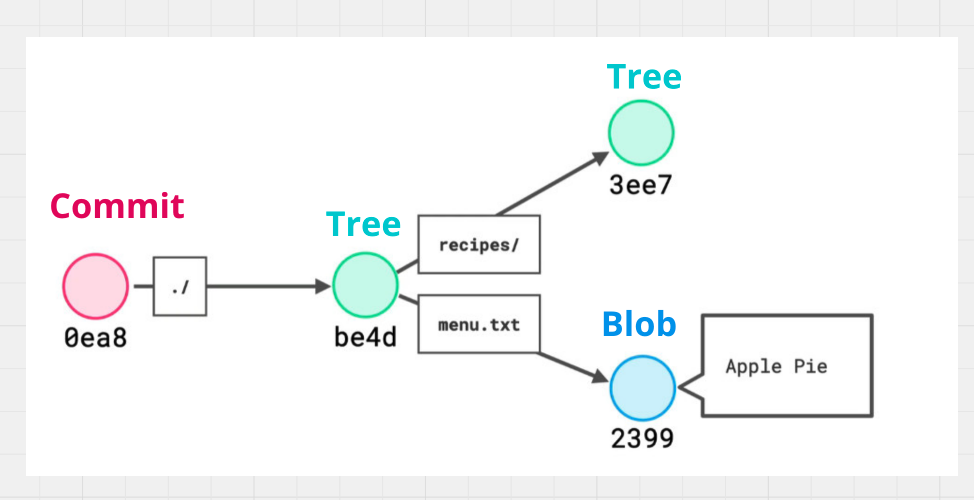

#  01 Les objets de `Git`

## `Git` est un `content tracker`

Lorsque l'on créé un dépôt avec la commande `git init` la `db objects` est vide :


Avant de pouvoir ajouter des `objets` je dois d'abord les `tracker` avec `git add`.


### `git status`

```bash
git status
```


Pour pouvoir exécuter un `commit` je dois d'abord ajouter les fichiers en `rouge` dans le `staging area` .


### `git add`

```bash
git add Recipies/*
```

```bash
git add menu.txt
```


Les fichiers sont maintenant en `vert`.

Le `staging area` est comme une piste de lancement


### `git commit`

On peut maintenant créer un `commit` :

```bash
git commit -m "First commit"
```


On a maintenant créer quelques objets dans la `DB Git`.


### `git log`

```bash
commit eab10df3183a576482dadd1f163bea033ab3bdf5 (HEAD -> master)
Author: hukar <k.meshoub@gmail.com>
Date:   Fri Aug 30 16:05:00 2024 +0200

    first commit
```


## Contenu d'un `commit`

```bash
git cat-file -t eab10df3183a576482dadd1f163bea033ab3bdf5

commit
```

Un `commit` est un objet `git` de type `commit`.

```bash
git cat-file -p eab10df3183a576482dadd1f163bea033ab3bdf5

tree 07f59177149804642f2044947d2b5a7e29f77bef
author hukar <k.meshoub@gmail.com> 1725026700 +0200
committer hukar <k.meshoub@gmail.com> 1725026700 +0200

first commit 
```

Un `commit` est un objet contenant un lien vers un `tree` (représentation d'un dossier), des métadonnées et le `message` du `commit`.

Tout comme un `blob`, un `commit` est préfixé par son type et sa taille, voici à quoi ressemble le fichier décompréssé :

```
commit 167\0tree 07f59177149804642f2044947d2b5a7e29f77bef\n
author hukar <k.meshoub@gmail.com> 1725026700 +0200\n
committer hukar <k.meshoub@gmail.com> 1725026700 +0200\n
\n
first commit\n
```


## Contenu d'un `Tree`

Tout comme un `blob` est l'équivalent d'un fichier stocké par `Git`, un `tree` est l'équivalent d'un répertoire stocké par `Git`.

```bash 
git cat-file -p 07f59177149804642f2044947d2b5a7e29f77bef

100644 blob cc74c7102d9940984446bbb701457b331b5bb082	menu.txt
040000 tree f09986f35e68e613e92b3e13f73ed5791e5d5f5f	my-recipies
```

Devant chaque type d'objet il y a `6` chiffres, c'est le `mode`

>**ChatGPT**
>
>### Format d'un objet `tree`
>
>Chaque entrée dans un objet `tree` contient les éléments suivants :
>
>1. **Mode** : Un nombre représentant les permissions et le type d'objet.
>   - `100644` : Un fichier ordinaire (non exécutable).
>   - `100755` : Un fichier exécutable.
>   - `040000` : Un répertoire (qui est un autre objet `tree`).
>   - `120000` : Un lien symbolique.
>2. **Type d'objet** : Soit `blob` pour un fichier, soit `tree` pour un répertoire.
>3. **SHA-1** : Le hash `SHA-1` de l'objet référencé (fichier ou sous-répertoire).
>4. **Nom du fichier ou répertoire** : Le nom de l'entrée (fichier ou sous-répertoire).

Il est impossible dans `Git` de tracker un dossier vide, on peut cependant tracker un dossier contenant seulement un dossier qui lui contient un fichier. Dès que le fichier est supprimé, les dossiers vide ne sont plus trackés.


## Contenu d'un `Blob`

```bash
git cat-file -p cc74c7102d9940984446bbb701457b331b5bb082

salad caesar
crevette sautées
spaghetti sauce tomate
tarte aux pommes
```

Un `blob` contient les données d'un fichier compressées et rien de plus (suffixées par le type et la taille).

Un `blob` n'est pas vraiment un fichier, mais le contenu d'un fichier. Les permissions et le nom du fichier ne sont pas contenus dans le `blob` mais dans un `tree` pointant vers ce `blob`. Si plusieurs fichiers ont le même contenu, celui-ci ne sera sauvé qu'une seule fois pour tous les fichiers.



> ### Un même contenu produira un même `hash`.

## Vue d'ensemble

Voilà ce qu'on observe dans une base de données `Git`:




## Résumé des objets


Il y a quatres sortes d'objets :

1. Les `blobs` représentant le contenu d'un fichier.
2. Les `trees` qui sont des sortes de répertoires non vide.
3. Les `commits` pointant sur le `tree root` et contenant des métadonnées.
4. Les `Annotated tags` car ils contiennent des métadonnées contrairement aux `tags` simples.
