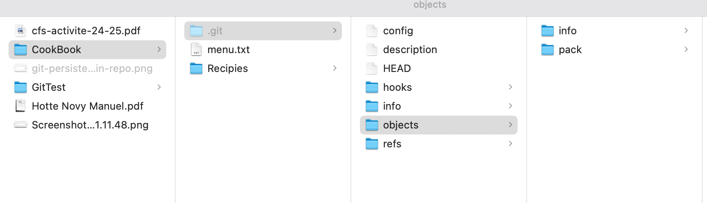
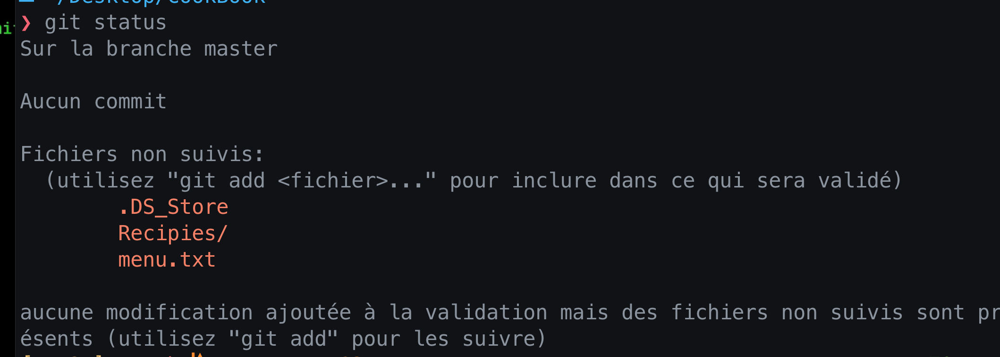
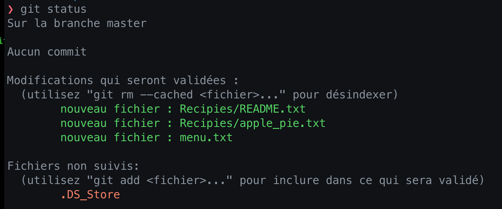
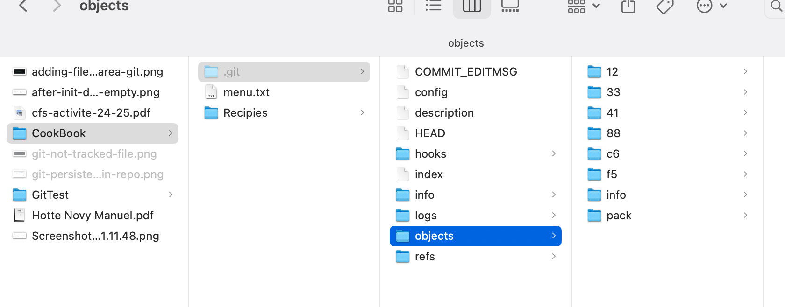
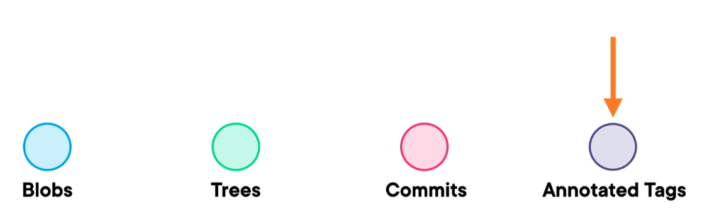

#  01 Les objets de `Git`

## `Git` est un `content tracker`

Lorsque l'on créé un dépôt avec la commande `git init` la `db objects` est vide :



Avant de pouvoir ajouter des `objets` je dois d'abord les `tracker` avec `git add`.


### `git status`

```bash
git status
```



Pour pouvoir exécuter un `commit` je dois d'abord ajouter les fichiers en `rouge` dans le `staging area` .


### `git add`

```bash
git add Recipies/*
```

```bash
git add menu.txt
```



Les fichiers sont maintenant en `vert`.

Le `staging area` est comme une piste de lancement


### `git commit`

On peut maintenant créer un `commit` :

```bash
git commit -m "First commit"
```



On a maintenant créer quelques objets dans la `DB Git`.


## Les objets



Il y a quatres sortes d'objets :

1. Les `blobs` (le contenu d'un fichier compressé)
2. Les `trees` (des sortes de répertoires)
3. Les `commits`
4. Les `tags`
