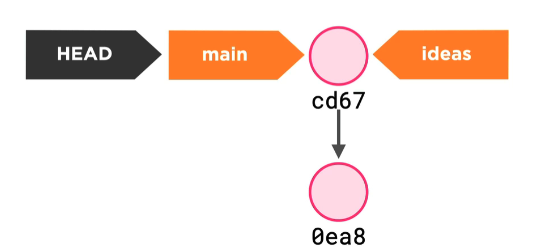
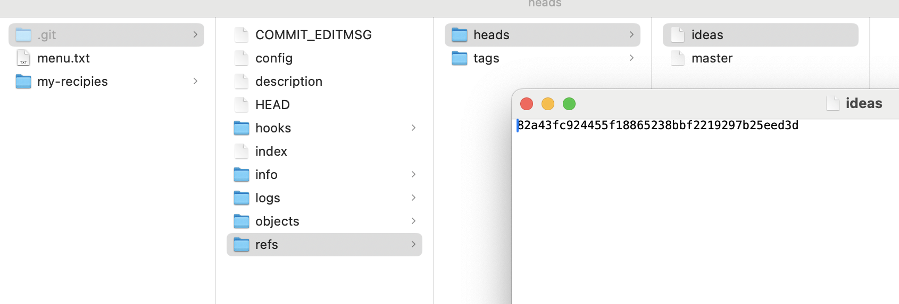
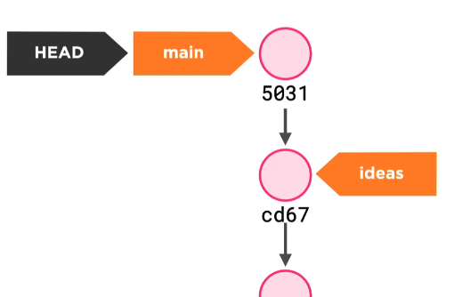
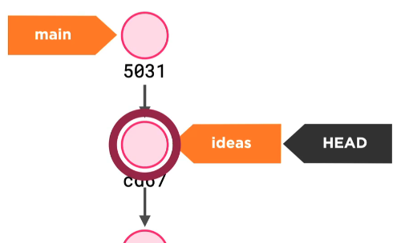
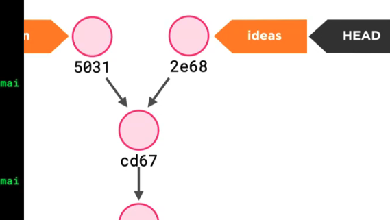

# 02 Les `branch`

## La base

### Lire le contenu d'un objet git

```bash
git cat-file -p 82a43fc924455f18865238bbf2219297b25eed3d
```


`HEAD` est une référence vers une `branch`.

```bash
cat HEAD
ref: refs/heads/master
```

Qui elle-même est une référence vers un `commit`

```bash
cat refs/heads/master
82a43fc924455f18865238bbf2219297b25eed3d
```

```bash
git cat-file -p 82a43fc924455f18865238bbf2219297b25eed3d

tree 15167a5aa3b538cd2c6dbbb97ae4c14a4c4aa2d4
author hukar <k.meshoub@gmail.com> 1724058415 +0200
committer hukar <k.meshoub@gmail.com> 1724058415 +0200

first commit
```




## Lister les branches

```bash
git branch

  ideas
* master
```


## Créer une branche

```bash
git branch ideas
```

Physiquement se sont des fichiers contenant le `hash` d'un `commit` :



Après un `commit` les `branches` divergent :




## Changer de `branch`

On peut indifféremment utiliser `switch` ou `checkout`. `switch` est plus spécifique (et plus récent).

```bash
git branch

  ideas
* master

git switch ideas
Basculement sur la branche 'ideas'

git branch

* ideas
  master
```

Après cette commande le contenu du dossier change et revient au `commit` où la branche à était créée.



Si on fait un nouveau `commit` maintenant on arrive à cette situation :



## Trois règles

- La `branch` courante suit les `commits`.
- Si on se déplace sur un autre `commit`, le répertoire de travail est mis à jour par `Git`.
- Les objets non-joignable (non-pointé par une `branch`, `HEAD` ou un `tag`) sont `garbage-collectés`.

