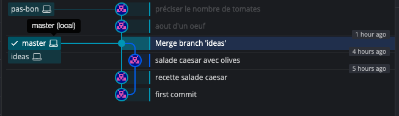

# 03 `Merge`


## 1. Retourner sur la branche principale `master`

```bash
git switch master

Basculement sur la branche 'master'
```


## 2. utiliser `merge nomdelabranche`

```bash
git merge ideas

Fusion automatique de my-recipies/salad-caesar.txt
CONFLIT (contenu) : Conflit de fusion dans my-recipies/salad-caesar.txt
La fusion automatique a échoué ; réglez les conflits et validez le résultat.
```


## 3. corriger manuellement les conflits

Si on ouvre le fichier `salad-caesar.txt` :

```
salad caesar

<<<<<<< HEAD
1 blanc de poulet
de laa laitue romaine
des copeaux de parmesan
une sauce caesar
des petites tomates
=======
2 blanc de poulet
de laa laitue romaine
des copeaux de parmesan
des olives
une sauce caesar
des petites tomates cerises

>>>>>>> ideas
```

On voit la partie appartenant à `HEAD` (qui est la branche `master`) et la partie de la branche `ideas`.

On doit ici corriger à la main :

```
salad caesar

1 blanc de poulet
de la laitue romaine
des copeaux de parmesan
des olives
une sauce caesar
des petites tomates cerises
```


## 4. Ajouter la correction

```bash
git add salad-caesar.txt
```


## 5. Faire un `commit`

```bash
git commit
```

```
Merge branch 'ideas'

# Conflicts:
#       my-recipies/salad-caesar.txt
#
# Il semble que vous validiez une fusion.
# Si ce n'est pas le cas, veuillez lancer
#       git update-ref -d MERGE_HEAD
# et essayez à nouveau.


# Veuillez saisir le message de validation pour vos modifications. Les lignes
# commençant par '#' seront ignorées, et un message vide abandonne la validation.
#
# Sur la branche master
# Tous les conflits sont réglés mais la fusion n'est pas terminée.
#
# Modifications qui seront validées :
#       modifié :         salad-caesar.txt
#
```

On peut éditer ou garder le message par défaut.

On tape ici `:` puis `wq` pour sauver et quitter `Vim`.

Si on observe le `commit` :

```bash
git cat-file -p 6f8b0ceda3d9210f4f5529dcf688c980b9605990
tree 7018b275d74a3f322aedc0427ef41f95caf14abe
parent 09b3c17a98ab2740a8d98795fdbf4b4ac3540611
parent 218c16fb485ca1fc754c4a544ded6c45aa60fddb
author hukar <k.meshoub@gmail.com> 1724071133 +0200
committer hukar <k.meshoub@gmail.com> 1724071133 +0200

Merge branch 'ideas'
```

On voit que ici on a deux `parents`.


Si on veut maintenant faire le `merge` inverse en se mettant sur la branche `ideas` et en faisant un `merge` vers `master`, `git` par économie, va économiser un `commit` et placer la `branch` sur le `commit` de `merge`.

```bash
git switch ideas
Basculement sur la branche 'ideas'
```


```bash
git merge master
Mise à jour 218c16f..6f8b0ce
Fast-forward
 my-recipies/salad-caesar.txt | 7 +++----
 1 file changed, 3 insertions(+), 4 deletions(-)
```

On a l'indication `Fast-forward` ce qui signifie que `git` a maintenant placé `ideas` sur le `commit` de `merge` :


## Detached `HEAD`

`HEAD` ne pointe pas forcement sur une `branch`, il peut directement pointer vers un `commit`.

```bash
git checkout 6f8b0ceda3d9210f4f5529dcf688c980b9605990

Note : basculement sur '6f8b0ceda3d9210f4f5529dcf688c980b9605990'.

Vous êtes dans l'état « HEAD détachée ». Vous pouvez visiter, faire des modifications
expérimentales et les valider. Il vous suffit de faire un autre basculement pour
abandonner les commits que vous faites dans cet état sans impacter les autres branches

Si vous voulez créer une nouvelle branche pour conserver les commits que vous créez,
il vous suffit d'utiliser l'option -c de la commande switch comme ceci :

  git switch -c <nom-de-la-nouvelle-branche>

Ou annuler cette opération avec :

  git switch -

Désactivez ce conseil en renseignant la variable de configuration advice.detachedHead à false

HEAD est maintenant sur 6f8b0ce Merge branch 'ideas'
```

On peut aussi utiliser `switch` comme ceci :

```bash
git switch 6f8b0ceda3d9210f4f5529dcf688c980b9605990 --detach
```

On est maintenant dans une situation expérimentale `Detached HEAD`.


Il n'y a donc pas de `branch` sélectionnée

```bash
* (HEAD détachée sur 6f8b0ce)
  ideas
  master
```


Après quelques `commit` une sorte de `branch` `HEAD` se forme :


Mais si je retourne sur une `branch` existante, je perds toute référence vers ces nouveaux `commit` et ils sont en quelque sorte `garbage collectés`.

```bash
git switch master
```


Je peux les récupérer juste avant grâce à leurs `Hash`, mais si je veux les persister je dois créer une branche :

```bash
git checkout ce58834
git branch pas-bon
git switch master
```



`HEAD` nous indique ou nous sommes dans un graphe `Git`, il est couramment sur une branche mais peut aussi être directement sur un `commit` et nous parlons alors de `Detached HEAD`.

