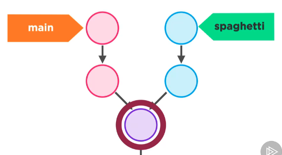
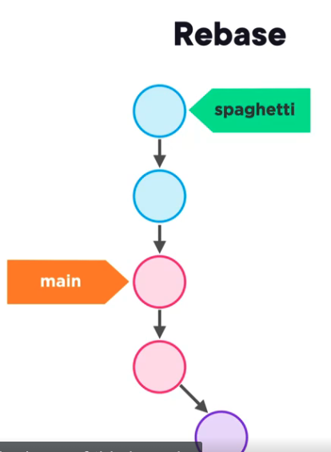
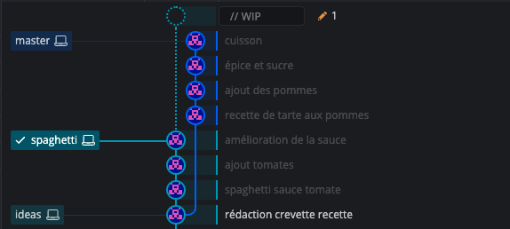
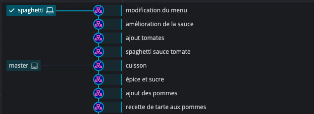
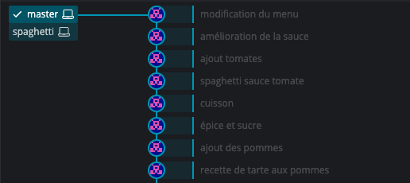
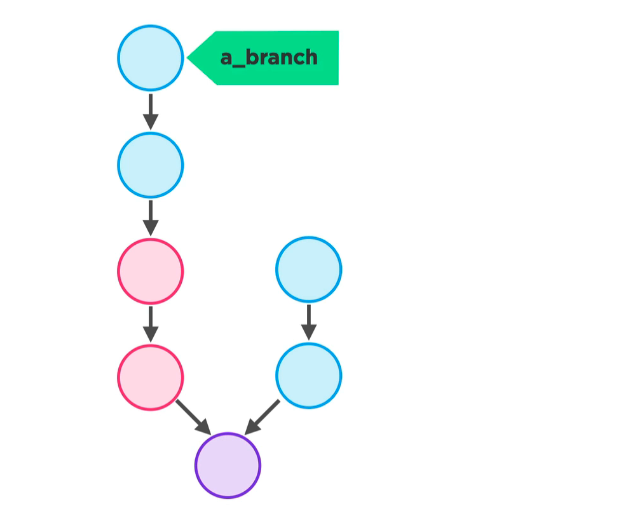
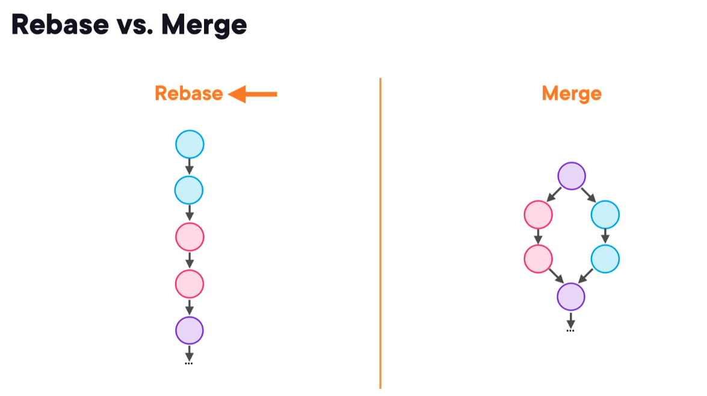

# 04 `Rebase`

C'est un peu la signature de `Git`.


## Fonctionnement

On a deux `branches` qui évolue en parallèle :



Le `commit` le plus récent de `master` (sur le schéma `main`) appartenant aussi à la `branch` `spaghetti` est la `base` de la `branch` `spaghetti`, ici entouré en rouge.

Un `rebase` va changer cette `base` en détachant une partie de la `branch` `spaghetti` et on aura au final ceci :



### On change la `base` => `rebase`



```bash
git rebase master
```



La `branch spaghetti` semble être déplacée sur la `branch master`.

> ### Il peut aussi falloir gérer les conflits comme avec `merge`.


### `Fast-forward`

Si on veut replacer `master` en haut du graphe on peut faire la manipulation inverse :

```bash
git switch master

git rebase spaghetti
```



> ### ! S'il semble que le `rebase` soit un simple déplacement, ce n'est pas le cas.
>
> Chaque objet de la base de données `.git` est immuable et son `hash` unique.
>
> chaque objet doit donc être copié son parent modifié et son `hash` recalculé.
>
> 
>
> Les `commits` restants n'étant plus pointés, plus joignables, ils seront `garbage-collectés` par `Git`.


## `Rebase` vs `Merge`



`Merge` ne transforme pas l'historique mais peut-être compliqué à suivre avec plusieurs `branches`.

Avec `Rebase` l'historique est propre et linéaire, mais il n'est pas vrai, il est artificiellement recréé avec `Rebase`.

Les `commits` bleu semblent avoir été créé après les rose avec `rebase`, ce qui n'est pas vrai.

`Merge` rend mieux compte de l'historique réel.

> ### Dans le doute, utiliser plutôt `merge`.


