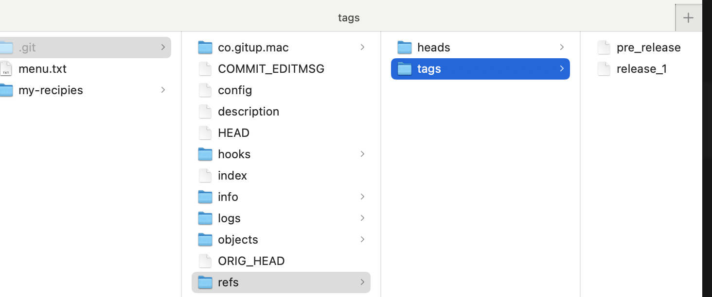
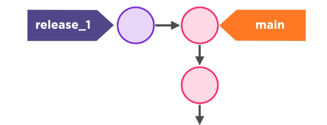
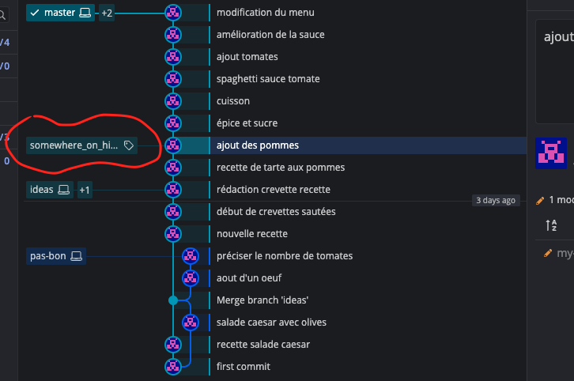
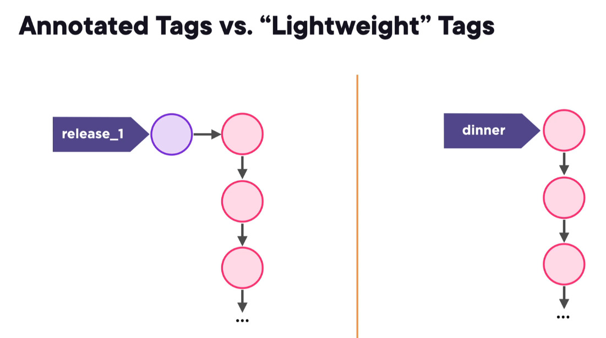

# 05. `Tags`


## Création d'un `Tag`

On peut créer un `tag` seulement avec son `label` ou aussi avec des `metadata` comme son `message` : `annotated tag`.

On utilise `-a` pour `annotated`.

`-m` pour message.

```bash
git tag release_1 -a -m "fisrt release, still instable"
```


## Lister les `Tags`

```bash
git tag

pre_release
release_1
```


## Mettre le `Head` sur un `tag`

On doit utiliser `checkout` et pas `switch` (qui ne fonctionne pas).

```bash
git checkout release_1
```

```bash
cat .git/HEAD
af8a9303827f133a24e53c3519c113ce0f06919b
```

On voit que le `HEAD` n'est plus sur une branche mais sur un commit précis.

```bash
git branch

* (HEAD détachée sur release_1)
  ideas
  master
  pas-bon
  spaghetti
```


## Anatomie d'un `Annotated Tag`



```bash
cat .git/refs/tags/release_1
21a148f683040f01d27ba32e2e842c5a73238738
```

Le fichier contient un `SHA` (`Secure Hash Algorithm`).

On peut lire son type et son contenu avec `cat-file` :

```bash
git cat-file 21a148f683040f01d27ba32e2e842c5a73238738 -t
tag
```

```bash
git cat-file 21a148f683040f01d27ba32e2e842c5a73238738 -p
object af8a9303827f133a24e53c3519c113ce0f06919b
type commit
tag release_1
tagger hukar <k.meshoub@gmail.com> 1724333525 +0200

super chouette realease, reste des troubles
```

Le `tag` pointe lui-même sur un `commit` et possède un `label` et des `metadatas`.



Un `tag` est une référence (proche des `branches`) pointant non pas sur un `commit` mais sur un objet de type `tag` et contenant une référence vers un `commit` et des `metadatas`.


## Simple `Tag`

On peut juste vouloir poser un label sur un `commit` sans avoir besoin de `metadatas`. On utilise alors `tag` sans l'option `-a` :

```bash
git checkout 3816ca2e1ce30a2d41313e90e4ec0fb65d8387aa
```

```bash
git tag somewhere_on_history
```

```bash
git switch master
```



On a alors juste poser un `label` sur un `commit` :

```bash
cat .git/refs/tags/somewhere_on_history
3816ca2e1ce30a2d41313e90e4ec0fb65d8387aa

git cat-file -t 3816ca2e1ce30a2d41313e90e4ec0fb65d8387aa
commit
```

On voit que l'objet pointé est directement un `commit` et non plus un `tag` comme précédemment.



Dans le cas d'un `tag` simple, on pourrait penser que c'est identique à une `branch`.

La différence est que la `branch` bouge vers chaque nouveau `commit` alors que le `tag` lui reste attaché sur le même `commit`.


