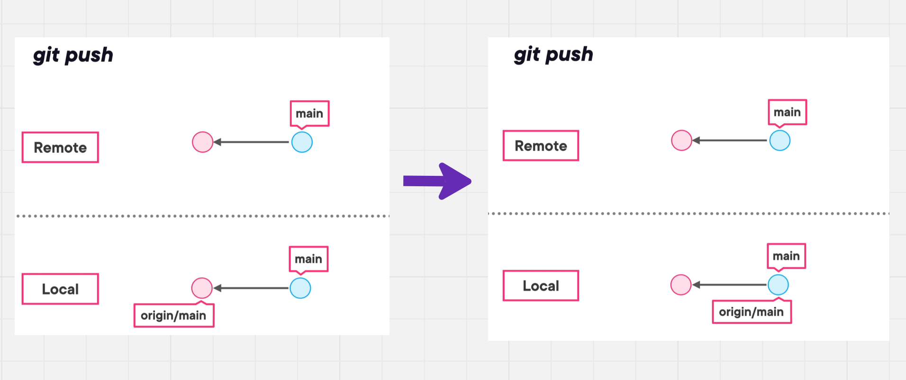
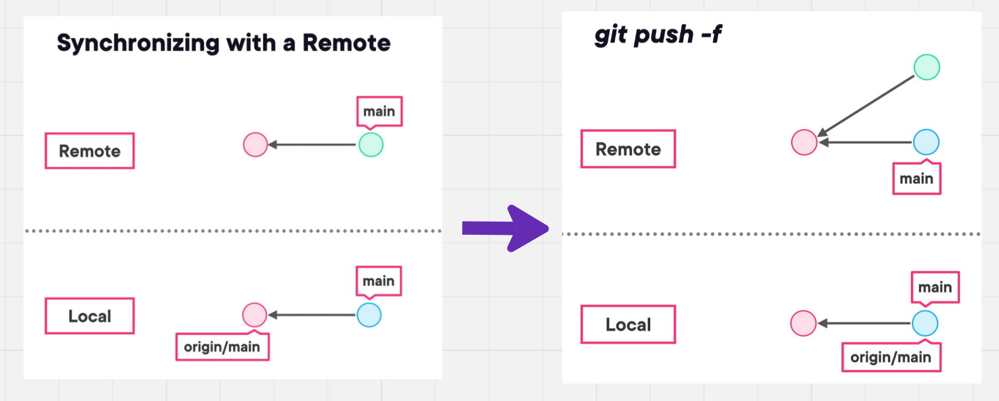
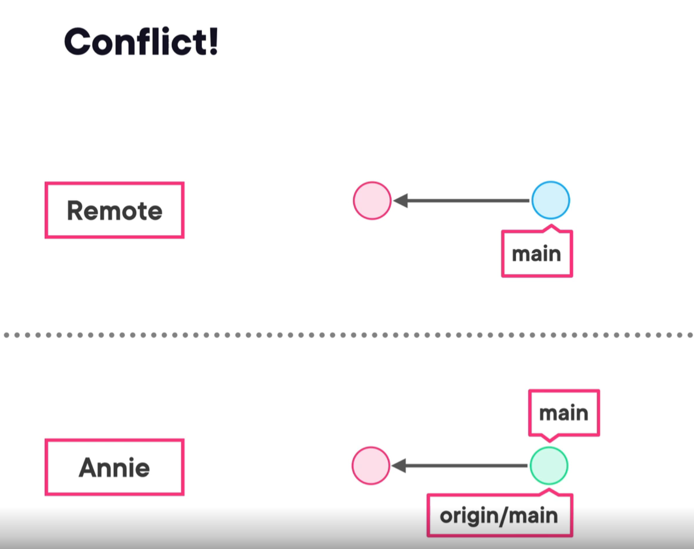
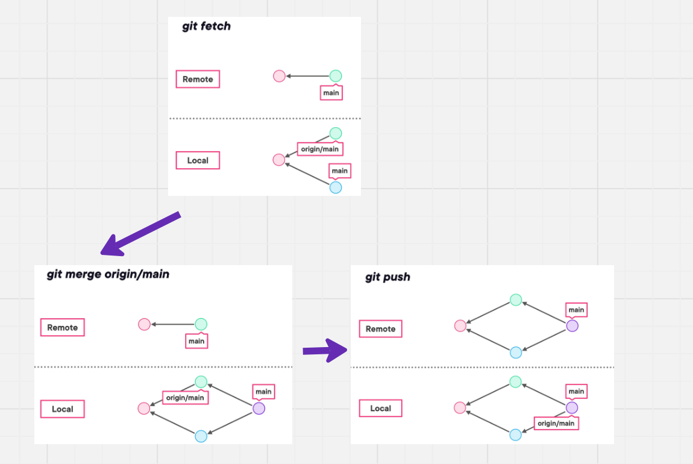

# 06 `Remote` repo


## Voire les dépôts `remote`

C'eat dans le fichier `config` :

```bash
cat config
[core]
	repositoryformatversion = 0
	filemode = true
	bare = false
	logallrefupdates = true
	ignorecase = true
	precomposeunicode = true
[submodule]
	active = .
[remote "origin"]
	url = https://github.com/eprolex-org/EprolexGreffeUI.git
	fetch = +refs/heads/*:refs/remotes/origin/*
[branch "main"]
	remote = origin
	merge = refs/heads/main
[lfs]
	repositoryformatversion = 0
```


## Comparer une branche en `local` et en `remote`

```bash
git show-ref main

435b4aae19c587d882635a1d5c781ff7f0c922ba refs/heads/main
435b4aae19c587d882635a1d5c781ff7f0c922ba refs/remotes/origin/main
```

Si maintenant j'effectue un commit en local, la branche `main` ne pointera pas vers le même `commit` en `local` et en `remote` :

```bash
git show-ref main

27a049719ce0ade90cf27e60e2c41ae078c5caf2 refs/heads/main
435b4aae19c587d882635a1d5c781ff7f0c922ba refs/remotes/origin/main
```

Un `git push` permet de resynchroniser le `remote` et le `local` :



On voit que la référence à `origin/main` est aussi mise à jour.


## `git push -f`

Si un `commit` entre en conflit sur le `remote` avec celui qu'on s'apprête à `push` on peut utiliser `-f` pour `forced`, cela ecrase le `commit` déjà sur le `remote`. Cette solution est destructrice.



Le `commit` vert sera éventuellement `garbage collected`.

Mais cela ne résout pas forcement le conflit, car si une autre personne a le `commit` vert dans son historique, c'est au tour de cette personne d'être en conflit avec le `remote`, ce qui revient à notre point de départ.




## Meilleur solution

-  `git fetch`
- `git merge origin/main`
- `git push`



On voit que `git fetch` rapatrie le `commit` du remote et créé une `branche`.

L'avantage de cette méthode c'est qu'on ne perd rien de l'historique.

C'est ce que fait la commande `git pull`.