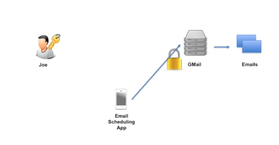
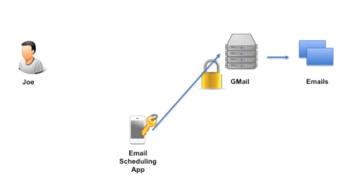
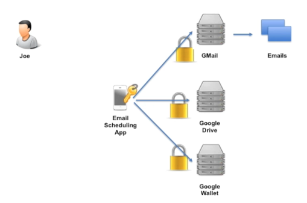
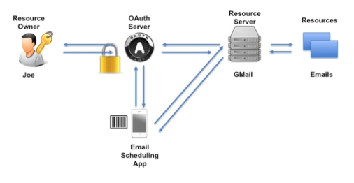

# 01 Introduction

## `OAuth` Mise en situation

Joe est le `resource owner`, `Gmail` étant le `resource server` et bien évidemment il contient les `email` de Joe qui sont les `resources` à proprement parlé.

Les `resources` sont protégées par `Gmail` grâce à un `password`.

Une `Third party app` souhaitent accéder à ces `email` pour offrir un système de planification des envoies (`scheduling`).

## `Password` anti-pattern

On pourrait vouloir seulement donner son `password` à l'application tiers.

Mais c'est une solution très dangereuse, car l'application tiers a ainsi accès à d'autres services protégés par le même mot de passe :

## Solution proposée par `OAuth 2.0`

On ajoute un nouvel acteur `OAuth server`.

Il va servir d'intermédiaire entre Joe, l'application tiers et le serveur `Gmail`.

C'est le `OAuth server` qui va demander les `credentials` de Joe et l'authentifier.

L'`OAuth server` va fournir un `token` en retour à l'application tiers.

Maintenant l'application tiers fait sa requête vers le `resource server` en joignant ce `token` obtenu auprès du `OAuth server`.

Le `resource server` va à son tour contacter le `OAuth server` pour savoir si le `token` est valide et attendre sa réponse avant de fournir l'accès aux `resources` demandées. 

