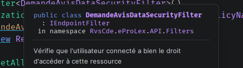

# Protection à l'accès aux données

C'est une deuxième couche de protection en plus des `Policies`.

Cette couche protège une donnée d'un `gestionnaire` ou d'un `déposant` ne travaillant plus ou pas pour un `demandeur`.

## Protection côté `API`

### Résumé de la procédure

>- juste ajouter le filtre `DemandeAvisDataSecurityFilter` sur les `endpoints` concernés.
>  Le placer de préférence après `DemandeAvisLoadAccessorFilter` pour éviter de charger deux la demande d'avis.


### Dans le `endpoint` : `AddEndpointFilter<DemandeAvisDataSecurityFilter>`

```cs
var route = app.MapGroup("/demande-avis/{demandeId:int}/delegue")
                .AddEndpointFilter<DemandeAvisLoadAccessorFilter>()
                .AddEndpointFilter<DemandeAvisDataSecurityFilter>()
                .RequireAuthorization(PolicyNames.PeutGererDemandeAvis, PolicyNames.HasUtilisateurId)
                .WithTags("DemandeAvis/{demandeId}/Delegue")
                .WithMetadata(new RequireDemandeAvisIdParameter());
```




## Protection côté `UI`

### Résumé de la procédure

> 1.  On utilise `response.EnsureApiSuccesResponse()` à la place de `response.EnsureSuccessStatusCode()` dans le `repo` concerné
> 2.  Dans un composant, on encadre un appelle du `repo` dans un `try and catch` avec un `when` et un appelle à `ApiCallService` (injecté dans le composant) `ApiCall.TryNavigateToApiError(ex, errorMessage)`

### Dans les `http repositories`

```cs
public class DelegueRepository(IHttpClientFactory httpClientFactory, AuthenticationStateProvider authenticationState)
    : BaseRepository(httpClientFactory, authenticationState), IDelegueRepository
{
    private readonly JsonSerializerOptions _jsonOptions = new()
    {
        PropertyNamingPolicy = JsonNamingPolicy.CamelCase,
    };

    public async Task<IReadOnlyList<Delegue>> GetForDemandeAvisAsync(int demandeAvisId)
    {
        var httpClient = await CreateHttpClientAsync();

        var response = await httpClient.GetAsync($"demande-avis/{demandeAvisId}/delegue");
        
        response.EnsureApiSuccesResponse();

        return await response.Content.ReadFromJsonAsync<IReadOnlyList<Delegue>>() ?? [];
    }
```

On a `EnsureApiSuccesResponse` au lieu de la méthode `.EnsureSuccessStatusCode`, celle-ci va envoyer des `exception` maison pour pouvoir agir sur des erreurs métiers précises.

Cette méthode est une méthode d'extension :

```cs
public static class HttpResponseMessageExtension
{
    extension(HttpResponseMessage response)
    {
        public void EnsureApiSuccesResponse()
        {
            switch (response.StatusCode)
            {
                case HttpStatusCode.Forbidden:
                    throw new ApiForbiddenException();
                case HttpStatusCode.NotFound:
                    throw new ApiNotFoundException();
                default:
                    response.EnsureSuccessStatusCode();
                    break;
            }
        }
    }
}
```


### Dans un `composant` utilisant un `repo`

```cs
@inject ApiCallService ApiCall
    
    // template

public async Task CreateDelegue()
{
    isAdding = true;
    // ...
    
    try
    {
        await DelegueRepository.CreateAsync(delegue);
        // ...
    }
    catch (Exception ex) when (ApiCall.TryNavigateToApiError(ex, $"Demande Avis Id: [{DemandeAvisState.CurrentRequired.Id}]")) { }
    finally
    {
        isAdding = false;
    }
```

On encadre l'appelle du `repo` pour attraper les `Exception` métier maison.

On cherche à rediriger vers des écrans explicite pour l'utilisateur : `NotFound` et `Fobidden`.

C'est `ApiCallService` qui centralise la logique de redirection.

```cs
public class ApiCallService(NavigationManager navigation)
{
    private readonly NavigationManager _navigation = navigation;

    public bool TryNavigateToApiError(Exception exception, string? errorMessage = null)
    {
        switch (exception)
        {
            case ApiForbiddenException:
                NavigateToError($"{(int)HttpStatusCode.Forbidden}", errorMessage, nameof(HttpStatusCode.Forbidden));
                return true;

            case ApiNotFoundException:
                NavigateToError($"{(int) HttpStatusCode.NotFound}", errorMessage, nameof(HttpStatusCode.NotFound));
                return true;

            default:
                return false;
        }
    }

    private void NavigateToError(
        string? statusCode = null,
        string? errorMessage = null,
        string? errorCode = null
    )
    {
        List<KeyValuePair<string, StringValues>> queryParameters = [];

        if (statusCode is not null)
        {
            queryParameters.Add(new KeyValuePair<string, StringValues>(nameof(statusCode), statusCode));
        }

        // ...

        var url = QueryHelpers.AddQueryString($"/{AppPage.Error}", queryParameters);

        _navigation.NavigateTo(url);
    }
}
```

Ici le `catch` ne fait rien si ce n'est pas une erreur métier maison (`custom exception`).

Il reste à gérer les autres erreur de manière global (peut être dans le router avec `ErrorBoundary`).


